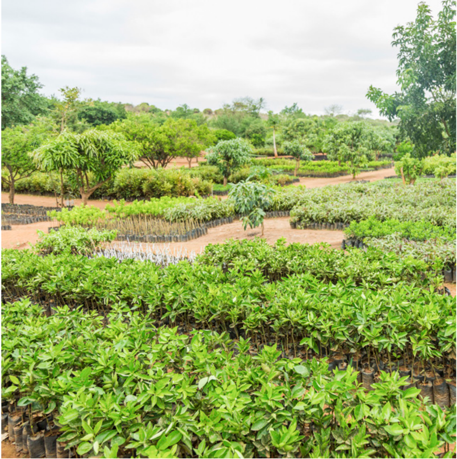

<!-- PDF page 16 | printed page 4 -->

# 1 General design of monitoring system

## 1.1 Role of sample-based area estimation in monitoring degradation, reforestation, and afforestation

by

*José Maria Michel, Emily Donegan and Frédéric Achard*

### Description of the problem

The development of SBAE has typically focused on deforestation, and less so on degradation, afforestation and reforestation, and forest carbon stock enhancement (sustainable management of forests and conservation). However, countries often seek to include these other activities in their REDD+ reporting. Sample-based area estimation may be a good approach to quantify the extent of these activities, but some considerations need to be made to adequately measure, report, verify and monitor them.

Forest degradation, as noted by the Intergovernmental Panel on Climate Change (IPCC),1 is defined in different ways by countries. One definition of forest degradation is that it is a human-induced loss in carbon stock in forestland remaining forestland. The IPCC notes however that current definitions often lack the quantitative and temporal aspects that would be necessary to meet the criteria for definitions under the Kyoto Protocol. Degradation is not an IPCC subcategory but rather a carbon stock change issue, and it is difficult to assess directly (biomass derived from radar and LIDAR sensors) or indirectly (through land cover maps) from remote sensing technology. Existing definitions do not facilitate the localization of degradation across an area of land. In current practice, many countries use proxies to localize degradation, such as the time series analysis of satellite images to estimate variations in tree crown cover, often in combination with field inventory data for validation and verification.

Simply using reduction in tree crown cover as a proxy can be inadequate, as it seems to underestimate degradation (Bullock *et al*., 2020). Degradation can apply to a broad range of different processes including forest fragmentation, selective logging and removal of undergrowth and litter. If the problem of defining and localizing degradation is adequately addressed, the next problem is how to monitor degradation consistently over time. Signs of degradation can be quickly obscured by vegetation regrowth, necessitating frequent (annual) monitoring. In addition, human induced degradation can be confused with natural disturbance processes such as windthrow. The question arises of whether all types of degradation can feasibly be monitored. In obtaining frequent time series data for monitoring, SBAE can increase efficiency, if suitable proxies are available, or if remote sensing data are used as auxiliary data to be combined with forest inventory data. Stratified sampling can also be applied, with stratification by degradation risk, as determined by past trends and proxies such as proximity to settlements and roads or changes in forest vegetation structure as a result of deforestation.

Defining and implementing adequate methodologies to monitor greenhouse gas emissions from forest degradation in a way that is acceptably accurate, easily validated and that does not run into temporal reporting issues can prove challenging. Soon-to-be-available imagery from new LIDAR and radar sensors should help, such as GEDI and BIOMASS (Dupuis *et al*., 2020), but depending on the availability of existing inventory data, may require setting up expensive permanent plots to define backscatter–biomass relationships. Further research is required to determine which remote sensing-based indicators or products are preferable for degradation. Current approaches and methodologies are dependent on definitions and the complexity of the landscape, such as mosaic of agriculture and forest.

Afforestation and reforestation are, by IPCC definition, practices implemented intentionally by people. Unlike forest degradation, the people practicing them would most frequently have no qualms in reporting on these activities. Therefore, extra effort to collect data on the location, timing and area of their occurrence could enable localization and monitoring.

<!-- PDF page 17 | printed page 5 -->

### Overview of existing good practices to address the issue

The REDD Sourcebook (GOFC-GOLD, 2016), complemented by the Global Forest Observations Initiative (GFOI) Methods and Guidance Document (MGD) (2020), provides a good overview of methods for monitoring REDD+ activities including degradation. New approaches now exist to more accurately map forests that experience canopy cover disturbance over a reference period, to be used for stratification in the sampling design phase (Shimabukuro *et al*., 2014; Lima *et al*., 2019). Maniatis and Mollicone (2010) provide a framework for forestland classification that includes degradation, conservation, afforestation and reforestation, based on which a national forest inventory (NFI) for REDD+ could be developed. Stratified sampling approaches have been used in the quantification of degradation. A recent example is Bullock *et al*. (2020), quantifying degradation in a region of Brazil, as well as the Forest Reference Emission Levels (FRELs) of Equatorial Guinea and Liberia (Equatorial Guinea, 2020; Liberia, 2019). The use of a systematic grid may be a good approach for multisectoral monitoring because it provides representative coverage of all lands, and a common sampling frame from which to assess many types of variables. It may also help in a first rough assessment of the quality of a forest area change map to be used for stratification. Some temporal changes such as *[forest > shifting cultivation > forest]* may be closer to forest degradation than deforestation, and a systematic approach could help reduce this confusion when deforestation and degradation are hard to distinguish.

### New good practices based on expert knowledge and experience

A sampling design based on a combination of a systematic approach, such as using a hexagonal equal area grid, and stratification can provide some flexibility to assess a range of parameters beyond deforestation. This type of multipurpose sampling design has been used in the Global Drylands Assessment (Bastin *et al*., 2017; FAO, 2019) and by FAO for the implementation of the Remote Sensing Survey of the Forest Resources Assessment 2020.2

The Democratic Republic of the Congo used a stratified sampling design for the determination of their FREL in the Mai-Ndombe province in the framework of the Emission Reductions Program of the World Bank (FCPF, 2016). About 37 000 sample plots were visually interpreted in Landsat imagery over six dates (over five periods for change assessment) using the following land cover classes: primary forest, secondary forest and non-forest. The visual interpretation of the secondary forest class and changes from and to this class proved to be challenging from Landsat imagery. More robust automated methods combined with reference data from field inventories or derived from very fine spatial resolution imagery are needed in such cases of low-impact selective logging.

What we have learned from national practices is that we can use SBAE to assess beyond deforestation, but it is necessary to have a robust interpretation (response) protocol to assess what the possible transition between a non-degraded forest and a degraded one is. For example, in the Democratic Republic of the Congo,3 they separate the classes of primary forest and secondary forest and identify the transitions between them. Another approach can be by counting elements (points within the sampling plot), which can be related to canopy cover and its dynamics, as is the case in the Dominican Republic (FCPF, 2019b)4 and Guatemala (FCPF, 2019a).5 Another good practice is the example of Nepal,6 where processes such as fragmentation and edge effects, known to be linked to degradation, are used to assist stratification, informed by landscape ecology and field observations when defining the buffers (FCPF, 2018).

<!-- PDF page 18 | printed page 6 -->

### Identify knowledge gaps that need to be addressed by research and development

Guidance needs to be provided on response design for: (i) definition of forest degradation (reduction of tree cover within a forested minimum map unit – what are the criteria?), and (ii) assessment of forest degradation through visual interpretation of change in tree canopy percentage within a sample plot. New remote sensing-based indicators for low impact canopy disturbances in tropical forests are only emerging (Langner *et al*., 2018) and need more research, in particular for the dryland domain. Upcoming radar sensors or other kinds of very high-resolution imagery should help but will require further research such as setting up permanent forest inventory field plots to define backscatter–biomass relationships.

Further research is needed on how we can ensure that the response design adequately captures degradation.

<!-- PDF page 19 | printed page 7 -->

### References

Bastin, J.-F., Berrahmouni, N., Grainger, A., Maniatis, D., Mollicone, D., Moore, R., Patriarca, C. *et al.* 2017. The extent of forest in dryland biomes. *Science*, 356(6338): 635–638. https://doi.org/10.1126/science.aam6527

Bullock, E.L., Woodcock, C.E. and Olofsson, P. 2020. Monitoring tropical forest degradation using spectral unmixing and Landsat time series analysis. *Remote Sensing of Environment*, 238: 110968. https://doi.org/10.1016/j.rse.2018.11.011

Dupuis, C., Lejeune, P., Michez, A. and Fayolle, A. 2020. How can remote sensing help monitor tropical moist forest degradation? – a systematic review. *Remote Sensing*, 12(7): 1087. https://doi.org/10.3390/rs12071087

Equatorial Guinea. 2020. *Forest Reference Emission Level*. REDD+ Web Platform. https://redd.unfccc.int/files/eg_frlsubmissions_2020_01_13.pdf

FAO (Food and Agriculture Organization of the United Nations). 2019. *Trees, forests and land use in drylands: the first global assessment – Full report*. FAO Forestry Paper No. 184. Rome. https://www.fao.org/3/ca7148en/CA7148EN.pdf

FCPF (Forest Carbon Partnership Facility). 2016. *Mai-Ndombe Emission Reductions Program, Democratic Republic of Congo*. Emission Reductions Program Document (ERPD). FCPF Carbon Fund. https://www.forestcarbonpartnership.org/system/files/documents/20161108%20Revised%20ERPD_DRC.pdf

FCPF. 2018. *People and Forests – a sustainable forest management-based emission reduction program in the Terai Arc Landscape, Nepal*. Emission Reductions Program Document (ERPD). FCPF Carbon Fund. https://www.forestcarbonpartnership.org/system/files/documents/Nepal%20ERPD%2024May2018final_CLEAN_0.pdf

FCPF. 2019a. *Guatemala National Program for the Reduction and Removal of Emissions*. Emission Reductions Programme Document (ERPD). FCPF Carbon Fund. https://www.forestcarbonpartnership.org/system/files/documents/Guatemala_ERPD_11_05_2019.pdf

FCPF. 2019b. Dominican Republic. Emission Reductions Programme Document (ERPD). FCPF Carbon Fund. https://www.forestcarbonpartnership.org/system/files/documents/Version%20ERPD%2014-08-2019%20Uncertainty%20correction-Trend%20in%20Ref%20level_rev.pdf

GOFC-GOLD (Global Observation of Forest and Land Cover Dynamics). 2016. *A sourcebook of methods and procedures for monitoring and reporting anthropogenic greenhouse gas emissions and removals associated with deforestation, gains and losses of carbon stocks in forests remaining forests, and forestation*. GOFC-GOLD Report version COP 22-1. Wageningen, Kingdom of the Netherlands, Wageningen University. http://www.gofcgold.wur.nl/redd/sourcebook/GOFC-GOLD_Sourcebook.pdf

Langner, A., Miettinen, J., Kukkonen, M., Vancutsem, C., Simonetti, D., Vieilledent, G., Verhegghen, A., Gallego, J. and Stibig, H.J. 2018. Towards Operational Monitoring of Forest Canopy Disturbance in Evergreen Rain Forests: A Test Case in Continental Southeast Asia. *Remote Sensing*, 10(4): 544. https://doi.org/10.3390/rs10040544

Liberia. 2019. *Liberia’s Forest Reference Emission Level submission to the UNFCCC*. REDD+ Web Platform. https://redd.unfccc.int/files/liberia_frel_submission_december_2019.pdf

Lima, T.A., Beuchle, R., Langner, A., Grecchi, R.C., Griess, V.C. and Achard, F. 2019. Comparing Sentinel-2MSI and Landsat 8 OLI Imagery for Monitoring Selective Logging in the Brazilian Amazon. *Remote Sensing*, 11(8): 961. https://doi.org/10.3390/rs11080961

Maniatis, D. and Mollicone, D. 2010. Options for sampling and stratification for national forest inventories to implement REDD+ under the UNFCCC. *Carbon Balance and Management*, 5(1): 9. https://doi.org/10.1186/1750-0680-5-9

Shimabukuro, Y.E., Beuchle, R., Grecchi, R.C. and Achard, F. 2014. Assessment of forest degradation in Brazilian Amazon due to selective logging and fires using time series of fraction images derived from Landsat ETM+ images. *Remote Sensing Letters*, 5(9): 773–782. https://doi.org/10.1080/2150704X.2014.967880

---

1 See https://www.ipcc.ch/site/assets/uploads/2018/03/Degradation.pdf

2 For the methodology of the FRA 2020 Remote Sensing Survey, see http://www.fao.org/forest-resources-assessment/remote-sensing/fra-2020-remote-sensing-survey/methodology/en

3 See https://www.forestcarbonpartnership.org/system/files/documents/20161108%20Revised%20ERPD_DRC.pdf

4 See https://www.forestcarbonpartnership.org/system/files/documents/Version%20ERPD%2014-08-2019%20Uncertainty%20correction-Trend%20in%20Ref%20level_rev.pdf

5 See https://www.forestcarbonpartnership.org/system/files/documents/Guatemala_ERPD_11_05_2019.pdf

6 See https://www.forestcarbonpartnership.org/system/files/documents/Nepal%20ERPD%2024May2018final_CLEAN_0.pdf
