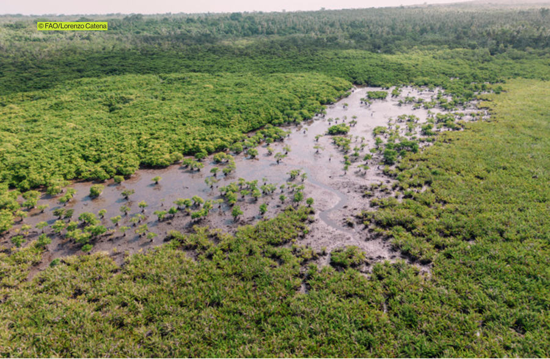

<!-- PDF page 24 | printed page 12 -->

## 1.3 Maintaining consistency as imagery improves

by

*German Obando Vargas, Erik Lindquist and Randy Hamilton*

It is essential to consider that according to paragraph 11 of Decision 14/CP.19,8 the reporting entity of the country must maintain “consistency in methodologies, definitions, comprehensiveness, and the information provided between the assessed reference level and the results of the implementation of the [REDD+] activities referred to in decision 1/CP.16, paragraph 70” (UNFCCC, 2014, p. 40).

However, remotely sensed information and the software (algorithms) and hardware used to estimate activity data are continually evolving. Improvements in spatial, temporal, and radiometric resolution mean better and more accurate characterization of the land surface and changes over time. This constant evolution is challenging when meeting operational reporting requirements that specify consistent approaches through time, such as Decision 14/CP.19.

Unfortunately, the use of better spatial and temporal imagery during the reporting periods can negatively affect the accuracy of the country’s estimate of emission reductions. In the context of visually interpreted SBAE, if a country assesses more change in recent years because of the increased resolution of available imagery that allows more changes to be observed, the forest emission estimation for the monitoring period is methodologically inconsistent and not comparable with the FREL. The change in imagery makes it impossible to estimate accurate emission reductions for the country.

According to the technical assessment scope in the annex to Decision 13/CP.19, paragraph three,9 the technical team of experts (TTE) appointed by the UNFCCC Secretariat provides feedback to the countries on areas of further technical improvement: “As part of the technical assessment process, areas for technical improvement [are] identified and these areas and capacity-building needs for the construction of future forest reference emission levels and/or forest reference levels may be noted by the [country]” (UNFCCC, 2014, p. 37). If the technical team of experts identifies technical improvement for activity data estimation, improved imagery must be considered to address activity data issues in the next reference emission levels.

Despite the need to maintain consistency between the reference level and monitoring period, countries can take advantage of imagery improvement in their assessment to understand the actual impact of their REDD+ implementation and ensure the conservativeness of their emission reduction assessment. The following suggestions (summarized in Table 2) are provided for two different types of analysis, based on expert knowledge and experience:

- **Estimating the uncertainty of the LULC maps.** In the case of using maps (and pixel counting) to estimate change, the specialist can use better spatial and temporal resolution imagery to collect reference data to estimate the uncertainty of the LULC maps. Any improvement in the imagery becomes available.10 For example, analysts can review the portions of the time series interpreted with coarse-resolution images to ensure the time series’ consistency with the interpretation of more recent very high-resolution imagery. Especially in those cases where the confidence in the LULC interpretation is not high, the analyst can use improved imagery to revise the class of change assigned in the original analysis. Once the time series analysis is revised, the reporting entity must recalculate the activity data and the FREL to maintain consistency.

<!-- PDF page 25 | printed page 13 -->

- **Directly estimating areas of change.** In the case of a country using an SBAE approach, practitioners have the following options for using better imagery while still maintaining consistency:
    - **Assess the conservativeness of emission reductions.** The reporting entity must maintain consistency in the minimum map unit and imagery sources used in the reference period through the reporting periods to ensure consistency between the activity data estimates of the reference level and the REDD results. In this case, the practitioner can use better imagery not necessarily to report but to ensure that activity data estimates based on the interpretation of original imagery sources are conservative. For example, the analyst can calculate the bias of the estimate of areas of change with the original imagery using the improved imagery for the monitoring period.
    - **Adjust the time series analysis.** It is considered good practice to track LULCs through time to accurately model carbon fluxes (see Section 2.3). Interpretation of the visually interpreted sample plots through time is therefore essential for the temporal tracking of LULCs. This type of time series analysis can be adjusted when better spatial and temporal resolution becomes available.11 For example, analysts can review the portions of the time series interpreted with coarse-resolution images to ensure the time series' consistency with the interpretation of more recent very fine-resolution imagery. Especially in those cases where the confidence in the LUCC interpretation is not high, the analyst can use improved imagery to revise the class of change assigned in the original analysis. Once the time-series analysis is revised, the reporting entity must recalculate the activity data and the FREL to maintain consistency.
    - **Recalculate the entire time series.** When “improved” imagery become available for the whole time series (reference level and monitoring periods), the country can switch to this improved data.
    - **Recalculate the entire time series.** When sources for this purpose would result in a better estimate of the map’s uncertainty. However, the same type of imagery should be used to create the maps.
    - **Prepare the stratification map for a reporting period.** Practitioners can use better spatial, temporal, and radiometric resolution data to prepare LULC maps to stratify the estimation area.

<!-- PDF page 26 | printed page 14 (list continues from previous page) -->

The following knowledge gaps related to this issue need to be addressed by research:

- What are the effects of using different spatial or temporal resolution datasets for stratifying or map-making on sample-based estimates of change?
- What are the effects of different spatial, temporal or radiometric resolutions on reference sample information and thus on area estimates and confidence intervals?

**Table 2** Use of improved imagery while still maintaining consistency in area estimation

|Scenario|Best practices|
|---|---|
|Sample plots are used as reference data to estimate the uncertainty of wall-to-wall LULC change maps|• Use finer spatial and temporal resolution imagery to collect reference data to estimate LULC change maps’ uncertainty. Any improvement in the imagery sources would result in a better estimate of the LULC change map’s uncertainty.|
|Sample-based area estimation|• Maintain minimum map unit and imagery sources used in the reference period through the reporting periods. • Use better data not necessarily to report but to ensure that estimates based on the interpretation of original imagery sources are consistent and conservative. • When better imagery is available for the entire time series, then a switch to this improved data can be made. • Use improved spatial, temporal, and radiometric resolution data to prepare LULC change maps to stratify the area of estimation for the reporting periods.|

**Source:** Authors’ own elaboration.

### References

UNFCCC (United Nations Framework Convention on Climate Change). 2014. *Report of the Conference of the Parties on its nineteenth session, held in Warsaw from 11 to 23 November 2013*. UNFCCC. https://unfccc.int/resource/docs/2013/cop19/eng/10a01.pdf#page=39

---

8 See https://unfccc.int/resource/docs/2013/cop19/eng/10a01.pdf#page=39

9 See https://unfccc.int/resource/docs/2013/cop19/eng/10a01.pdf#page=34

10 The bias in the interpretation of medium-resolution imagery such as Landsat and Sentinel was consistently greater (8 percent in average) than that observed for very fine-resolution imagery in the Dominican Republic SBAE analysis.

11 The bias in the interpretation of medium resolution imagery such as Landsat and Sentinel was consistently greater (8 percent in average) than that observed for very fine resolution imagery (VFRI) in the Dominican Republic SBAE analysis.
