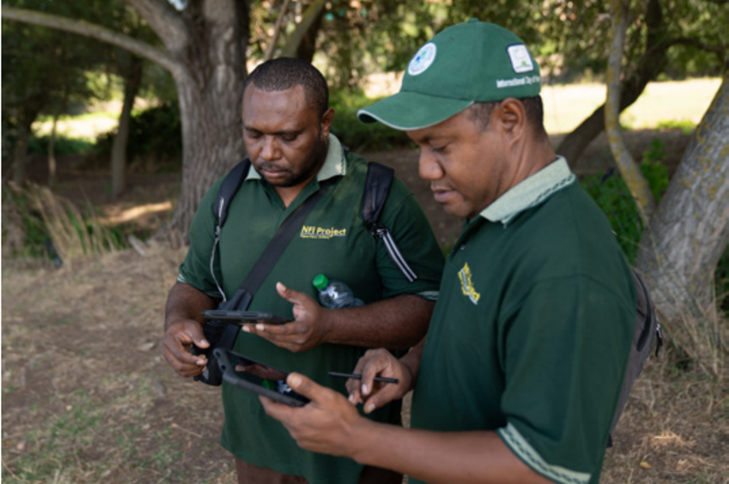
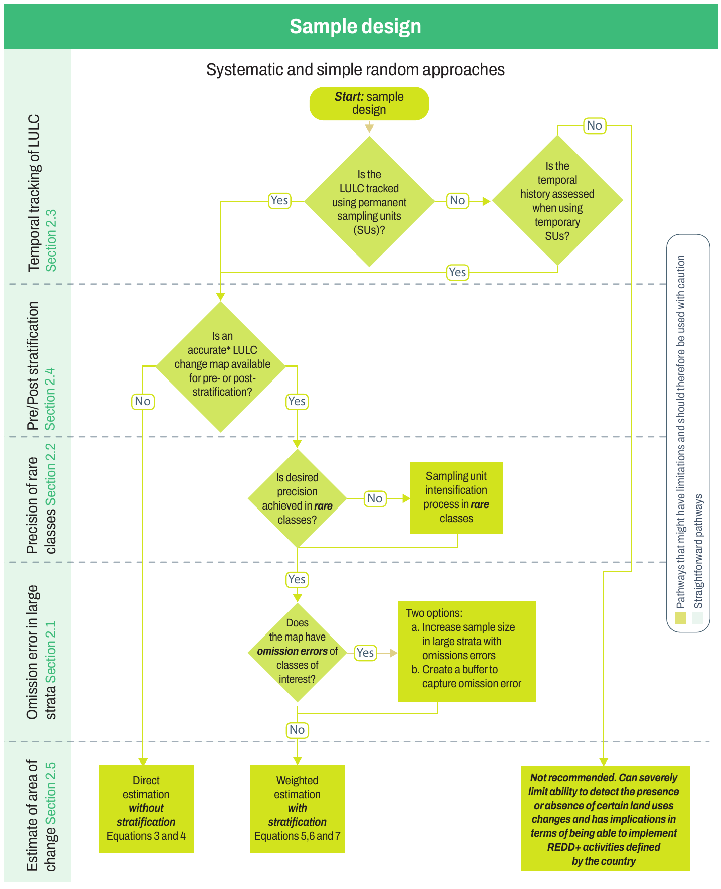

<!-- PDF page 30 | printed page 18 -->

# 2 Sampling design

When implementing SBAE, particular attention should be paid to developing a sampling design that achieves the desired outcome in an efficient and cost-effective manner. Over the years, countries have implemented a variety of sampling designs, encountering several challenges along the way. This section attempts to address and provide practical guidance on some of these challenges and associated questions related to sampling design that have arisen from country experiences. In particular, this section presents special considerations and recommendations on:

1. estimation difficulties caused by errors of omission of a rare category of interest, such as deforestation, occurring in large strata (Section 2.1);
2. sampling design of a multipurpose monitoring system (Section 2.2);
3. tracking the temporal history of sample units to correctly identify land use changes (Section 2.3);
4. updating a high-quality base map as source of stratification rather than creating new strata each reporting cycle (Section 2.4); and
5. theoretical and practical implications and differences among two-stage, cluster, and two-step sampling strategies (Section 2.5).

Figure 1 presents a decision tree that shows the interrelationship of these topics and outlines the flow of sampling design decisions.

<!-- PDF page 31 | printed page 19 -->

**Figure 1** Decision tree of interrelated topics in Section 2 and order of decisions to be made

**Notes:** Courtesy of German Obando-Vargas.

\* An accurate map is considered to be one in which the areas of change are within the confidence intervals of the sample-based estimates from an independent sample. It is recommended that a confusion matrix be constructed and the omission errors evaluated.

**Source:** Authors' own elaboration.
