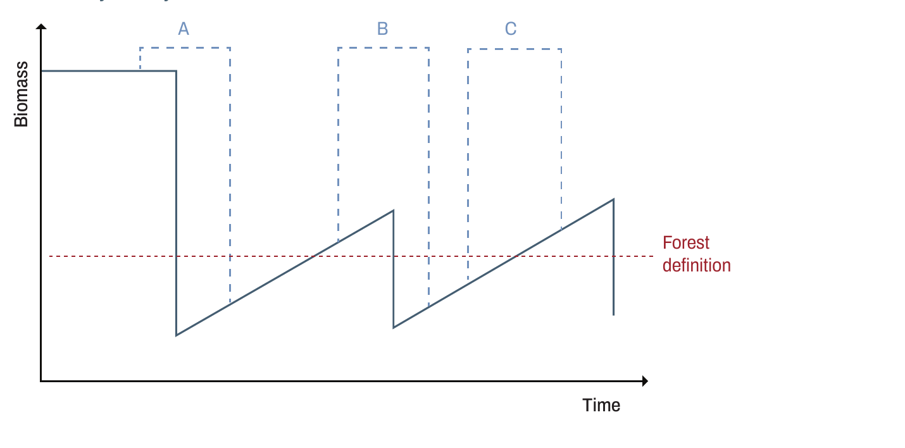
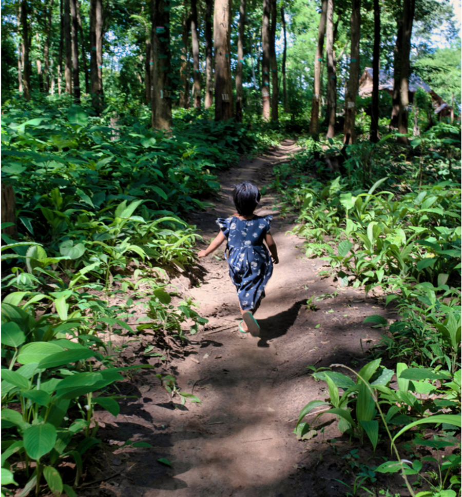

<!-- PDF page 42 | printed page 30 -->

## 2.3 Temporal tracking of land use in the context of temporary versus permanent sample units

by

*Andres Espejo and Randy Hamilton*

Stratified random sampling has frequently been used to estimate the areas of change during a given monitoring period as this approach is a statistically efficient way to estimate the area of change. However, usually STR is implemented in successive monitoring periods, in the form of independent surveys (new sample units are drawn in each survey so they are temporary).

Unfortunately, the use of independent surveys and temporary sample units does not enable the consistent and explicit tracking of land use spatially and temporally (IPCC Approach 3). This might have serious implications as to our ability to detect actual land use change or enable the implementation of the definitions of REDD+ activities defined by the country. For example, trees can be removed or reappear in the landscape without a change in land use, which occurs in the case of forest plantations, slash-and-burn agriculture, or logging in natural forest. If independent surveys and temporary sample units are used, the changes in these systems could be mischaracterized as land use change or any one of these changes could be identified as deforestation, forest degradation or enhancement of carbon stocks, depending on the timing of survey (compare with Figure 2).

The use of independent surveys and temporary sample units could also lead to “double detection” of land use transitions if the timing of assessments happens to coincide with consecutive cutting or regeneration cycles of a forest plantation or the clearing (compare with Figure 1), such as regrowth and clearing cycles that are common in secondary forests in Central Africa.

**Figure 2** Characterization of a unit of land subject to conversion from natural forest to a cyclical system

**Note:** The same unit of land could be classified as deforestation (A, B) or enhancement (C) depending on the part of the system cycle covered by the monitoring period. In this specific case, the same unit of land could be classified as deforested twice, which depending on the country’s definition of deforestation, might cause a “double detection”.

**Source:** Author’s own elaboration.

<!-- PDF page 43 | printed page 31 -->

The lack of temporal tracking can also make it difficult to accurately model carbon fluxes. For instance, in enhancement of carbon stocks, it is important to know the age of a regenerating forest to be able to apply growth models and correctly estimate carbon fluxes. Two-date temporary sample units lack the ability to determine forest age using imagery.

The challenges presented above can be overcome through three approaches:

- **Temporal history of temporary sample units:** Assessing the history of each sample unit in the years prior to the monitoring period maximizes the likelihood of correctly determining whether a land use change has occurred or not. It also maximizes the probability of and being able to effectively apply the REDD+ definition adopted by the country. For instance, Indonesia defines deforestation as the conversion of natural forest cover to other land cover categories (plantation forest or non-forest lands) that occurred once in an area, meaning that deforested areas that might regenerate and again meet the forest definition were not taken into account a second time in the emission calculation from deforestation.17 If independent surveys and independent sample units are used in successive surveys, there is the risk of a “double detection” as previously described. In order to resolve this, the strategy followed with maps of masking out areas previously reported as deforested may be replicated by ensuring that the interpreters look into the past history of the sample unit and ensure that no losses have occurred previously.

- **Permanent sample units:** An alternative to the historical review of temporary sample units is to use an SYS or SRS of permanent sample units. This ensures the temporal tracking of the units through time. However, systematic sampling is not as efficient for characterizing small areas of change and could require a very large sample to achieve the desired precision for each variable of interest, such as area of deforestation. Alternatively, the precision could be improved by post-stratifying a base systematic sample and, if necessary, adding additional temporary sample units into areas of change or other areas of interest (see Section 2.1 and Section 2.2). The temporal history of these new sample units would need to be assessed as previously described.

- **Permanent sample units with stratification:** Another possible solution, which is a combined approach of using a systematic grid of permanent sample units and stratified estimation with temporary sample units, is to implement a variation on the approach that Suriname has implemented (Suriname, 2018). Suriname created a high-quality base map that was then updated with cumulative change (including all areas that have been restored or deforested progressively since the beginning of the reference period). The initial stratified sample units would become permanent and new sample units (that could be interpreted for the whole time series and become permanent) would be added to the initial sample in new areas of change that appear. The use of cumulative stratification and permanent sample units would enable the temporal tracking of units through time with a lower sampling intensity. This task could become complex over time, as the number of strata would increase progressively, which would complicate the estimation process (see Section 2.4).

One last consideration regarding the use of temporary and permanent sample units is the ability to characterize the age of regenerated forests which might be required to estimate removals from enhancements of carbon stocks. The age of regenerated forests can be determined by looking at the history of the sample units and assigning an age class to the sample unit (first approach above); however, in order to obtain reasonably precise estimates of forest in the different age classes, a sufficient number of sample units would be required for each age class, which might be complex. The second approach would present this same limitation in terms of efficiency, but the third approach could be used efficiently to estimate areas of different age classes.

<!-- PDF page 44 | printed page 32 -->

### References

Suriname. 2018. *Forest Reference Emission Level for Suriname’s REDD+ Programme*. Paramaribo, REDD+ Suriname, National Institute for Environment and Development in Suriname. https://redd.unfccc.int/files/2018_frel_submission_suriname.pdf

---

17 See https://redd.unfccc.int/files/frel_submission_by__indonesia_final.pdf#page=14
