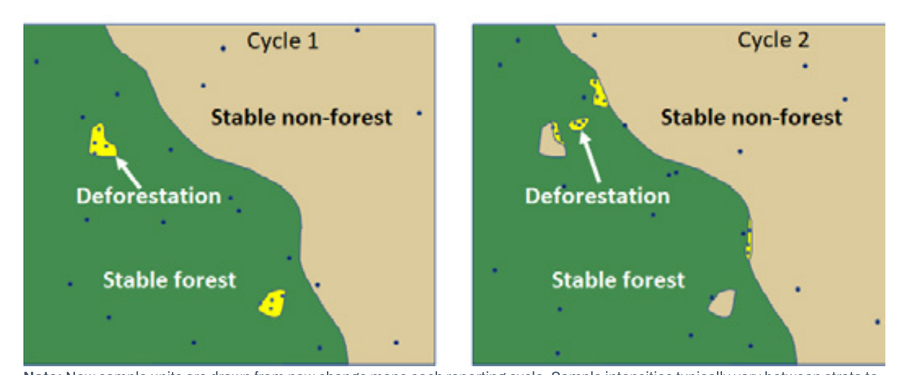
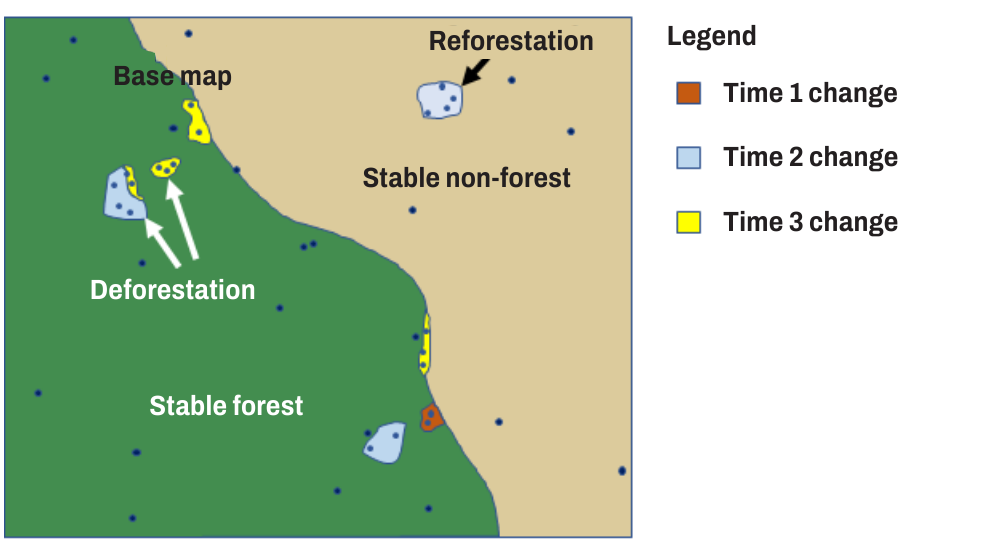
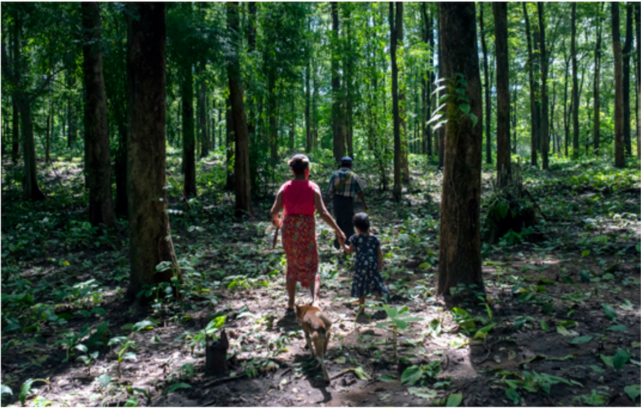

<!-- PDF page 45 | printed page 33 -->

## 2.4 New stratification versus updating a base map for stratified area estimation

by

*Inge Jonckheere, Randy Hamilton and Rémi d’Annunzio*

Some countries create a new stratification map for each reporting interval (with a new set of sample units), while others have created a very high-quality base map that is updated through time. In the latter case, new sample units are added in areas of change and existing sample units are reevaluated. Both options are possible: here we will discuss the pros and cons of these two approaches and the use of temporary versus permanent sample units.

Although this is a high-priority topic for countries, there is neither much available guidance nor much existent scientific literature. Clearly both complementary and new guidance is needed based on more recent research in this field.

Based on current literature, it appears that either approach could be effective. However, the cost of creating an updated map versus the cost of creating a new stratification map is a relevant consideration. The temporary versus permanent sample unit question depends on the desired objectives (see Section 1.2). If the objectives require a time series of observations at the same locations, then it is necessary to use permanent plots. On the other hand, if the objectives are a series of separate estimates for multiple change periods, such as a series of biannual estimates, then having new strata for each change period is probably desirable.

Both options are graphically explained in Figure 3 and Figure 4.

**Figure 3** Illustration of a traditional stratified random sample with temporary sample units

**Note:** New sample units are drawn from new change maps each reporting cycle. Sample intensities typically vary between strata to optimize sampling efficiency.

**Source:** Authors’ own elaboration.

<!-- PDF page 46 | printed page 34 -->

**Figure 4** Illustration of a stratified random sample with base map updated through time and sampl using permanent plots

**Note:** The original plots are reinterpreted as well as all new plots added to change areas.

**Source:** Authors’ own elaboration.

The example of the Suriname FREL 2018 shows the update of a very high-quality map in practice (Suriname, 2018).

There are other possible alternatives for the future, also including deep learning and upcoming artificial intelligence technologies (Lang, 2019; Araza *et al*., 2020). For example, the use of Sentinel-2 (or other high-resolution data) in conjunction with airborne LIDAR or GEDI (Dubayah *et al*., 2020; Bruening *et al.*, 2023) may make automated algorithms more trustworthy than visual interpretation (Dubayah *et al*., 2020). If normal optimal or other base maps are still intended to be used, one could also use these algorithms as the reference samples.

<!-- PDF page 47 | printed page 35 -->

### References

Araza, A., De Bruin, S., Herold, M., Quegan, S., Labriere, N., Rodriguez-Veiga, P., Avitabile, V. *et al.* 2022. A comprehensive framework for assessing the accuracy and uncertainty of global above-ground biomass maps. *Remote Sensing of Environment*, 272: 112917. https://doi.org/10.1016/j.rse.2022.112917

Bruening, J. M., May, P. B., Armston, J. D., & Dubayah, R. O. 2023. Precise and Unbiased Biomass Estimation From GEDI Data and the US Forest Inventory. *Frontiers in Forests and Global Change*, 6, 1149153.

Dubayah, R., Blair, J.B., Goetz, S., Fatoyinbo, L., Hansen, M., Healey, S., Hofton, M. *et al.* 2020. The Global Ecosystem Dynamics Investigation: High-resolution laser ranging of the Earth’s forests and topography. *Science of Remote Sensing*, 1: 100002. https://doi.org/10.1016/j.srs.2020.100002

Lang, N. 2019. Deep learning reconstructs forests in 3D using only satellite images. In: EcoVisionETH. Cited 17 September 2020. https://medium.com/ecovisioneth/mapping-forest-structures-with-deep-learning-c1d3c1b41e4e

Suriname. 2018. *Forest Reference Emission Level for Suriname’s REDD+ Programme*. Paramaribo, REDD+ Suriname, National Institute for Environment and Development in Suriname. https://redd.unfccc.int/files/2018_frel_submission_suriname.pdf
