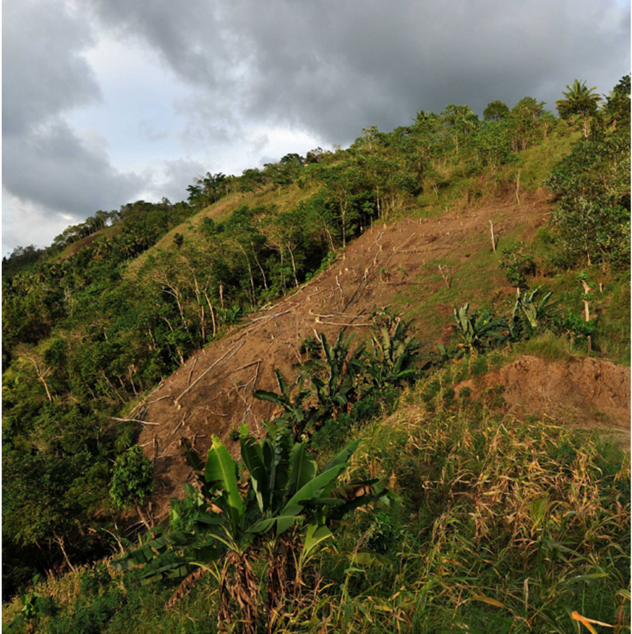
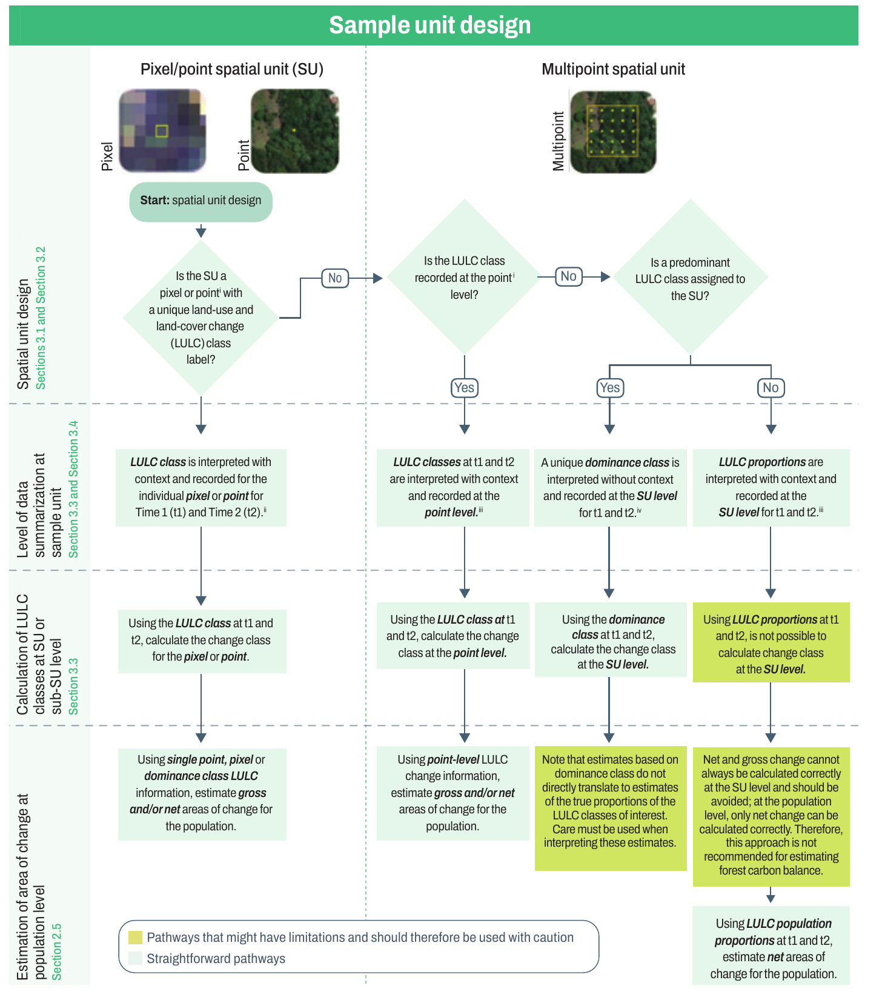

<!-- PDF page 60 | printed page 48 -->

# 3 Response design

The most effective designs for SBAE or other types of inventories are constructed using a logical sequence of steps. These steps, variations of which have been described elsewhere (Lister *et al*., 2015) include assessing information needs, identifying constraints, determining allowable error for key attributes (commonly expressed as a given sampling error at a specified confidence level, such as a sampling error of 10 percent of the estimate with a 95 percent confidence level), designing the sample unit (or plot), and determining the sampling design. This section seeks to provide practical guidance on the plot design step by exploring: the implications of using point-based or pixel-based sample units versus multipoint area-based plots (Section 3.1); considerations related to the size of an area-based plot and the number of points with which to subsample the plots (Section 3.2); the impacts of different labelling protocols for area-based plots (Section 3.3); and the effects of interpreting land use with or without context (Section 3.4). Figure 5 presents a decision tree that shows the interrelationship of these topics and outlines flow of plot design decisions.

<!-- PDF page 61 | printed page 49 -->

**Figure 5** Decision tree of interrelated topics in Section 3 and order of decisions to be made

**Notes:** Courtesy of German ObandoVargas.

i The term “point” in the pixel/point sample unit column refers to a sample unit that is a single dimensionless point. In the multipoint sample unit column, “points” refers to the points within a plot that are evaluated to determine the land use and land cover composition of the plot.

ii Interpretation with context-individual point/pixel scenario: the land use context around the point (or pixel) is evaluated to determine the corresponding land use. Specifically, the interpreter mentally delineates boundaries around the land use intersected by the point/pixel while applying the appropriate definitions, such as minimum area, canopy cover (in the case of forest), and potentially minimum widths. The corresponding land use is assigned to the point/pixel.

iii Interpretation with context: the land uses are interpreted by applying the land use definitions to the landscape patterns within and without the multipoint sample unit. The interpreter mentally delineates boundaries around the different land uses while applying their respective definitions, such as minimum area, canopy cover (in case of the forest), and potentially minimum widths. The corresponding land use is assigned to the points within the sample unit. These may be recorded at the point level or converted to proportions and recorded at the sample unit level depending on the pathway.

iv Interpretation without context: for forest land use, the forest definition is applied with the sample unit as the frame of reference for applying the forest definition rather than the irregular landscape patterns (inside and outside the sample unit) as the frame of reference. If the minimum canopy cover threshold within the sample unit is met, the entire sample unit is considered to be forest.

**Source:** Authors’ own elaboration.

<!-- PDF page 62 | printed page 50 -->

### References

Lister, A.J., Scott, C.T., Brewer, C.K. and Stein, B.R. 2015. *Forest inventory design principles – challenges and solutions*. Proceedings of the XIV World Forestry Congress, September 7–11, 2015, Durban, South Africa. FAO. http://foris.fao.org/wfc2015/api/file/55e721863a4836e65ca6b509/contents/d287e4b5-6b9a-4b65-8112-13a5d0b5d073.pdf
