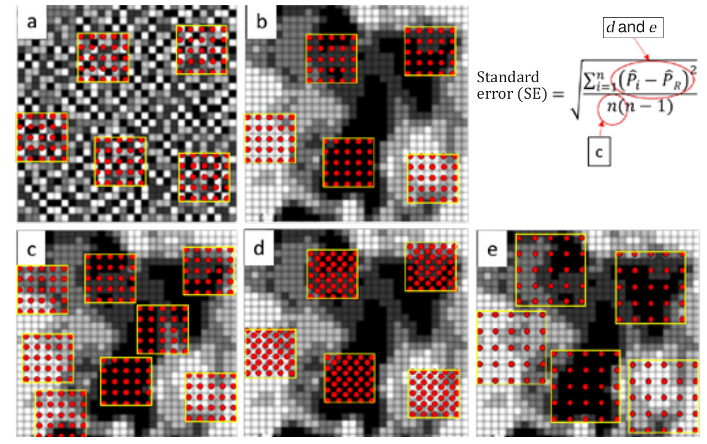
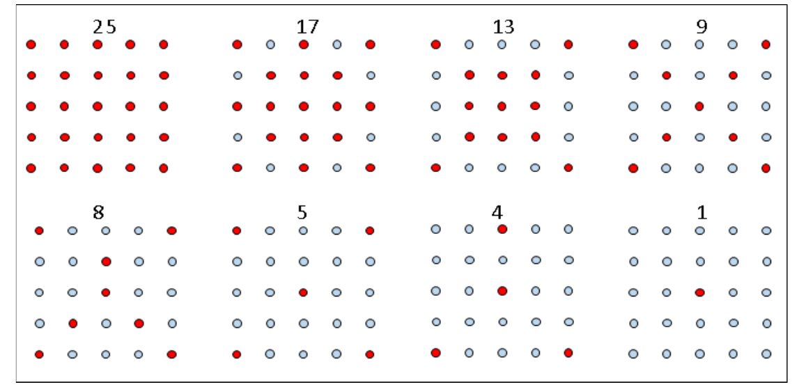
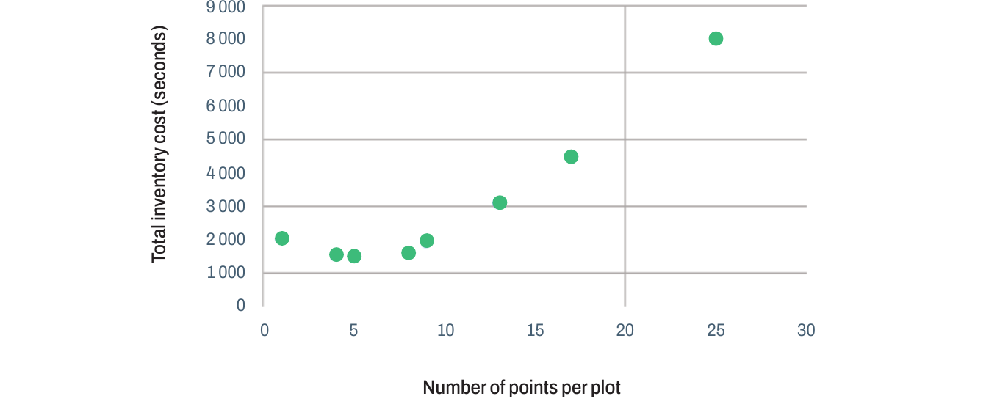

<!-- PDF page 66 | printed page 54 -->

## 3.2 Area-based sample unit design: number of points and sample unit size

by

*Andrew Lister, Paul Patterson and Randy Hamilton*

Common questions posed by countries implementing SBAE using larger area-based sample units (or plots) include: how many plots are needed; how large should they be and how many points should be placed within each one? The optimal design of area-based sample units can be informed from basic principles of statistics. Figure 6 empirically illustrates several important principles. Standard error (SE in Figure 6) is a commonly used measure of uncertainty and is used in the construction of confidence intervals. Standard error is the square root of the variance of the estimate from Section 2.5. Figure 6a shows a landscape where the plots contain a mix of class values – about the same mix as occurs on the landscape as a whole. What this means is that each plot-level proportion ($\hat{P}_i$) will be very much like the sample mean proportion ($\hat{P}_R$), and standard error will be low because the numerator of the equation will be small. Figure 6b, however, shows a landscape where each plot only has one or possibly two class values. In this example, some plots are very different from the sample mean proportion of each class, leading to a larger numerator and a higher standard error. Thus, we see that the landscape configuration can have a significant impact on the standard error.

To lower the standard error in the landscape of Figure 6b, one can increase $n$ (put out more plots), increasing the denominator of the standard error equation, as shown in Figure 6c. Another option is to increase the number of points within the plot (Figure 6d), which will tend to lower the standard error. The next section on number of points per sample unit shows explicitly how an increase in the number of points per plot affects the variance; a reduction in the variance causes a reduction in the standard error. The relationship between the variance and the standard error is complicated and not obvious, as well as beyond the scope of this paper. Finally, one can increase the size of the plot to capture more of the variability on the landscape on each plot, making each plot-level proportion more like the sample mean proportion, lowering the numerator and standard error (Figure 6e).

In summary, the standard error can be reduced by increasing the sample size, $n$, increasing the number of points within the plot or by increasing the size of the sample unit. The trick of optimal design is choosing which combination of options (Figure 6c, Figure 6d and Figure 6e) leads to the lowest cost evaluation that will meet the needs of users.

<!-- PDF page 67 | printed page 55 -->

**Figure 6** Illustration of two landscapes with different spatial distributions

**Notes:** Illustration of two landscapes with different spatial distributions of the landscape elements (a) and (b), along with different sample unit designs that affect the calculation of the standard error (SE): (c) increased sample size, *n*, (d) increased point density per plot and (e) increased plot size. In the equation, $\hat{P}_i$ is the proportion of points in the class of interest on plot *i*, $\hat{P}_R$ is the average proportion across all plots, and *n* is the number of plots in the sample (see Section 2.5 for details on calculating the proportions).

**Source:** Authors’ own elaboration.

#### Number of points per sample unit

Countries implementing SBAE using larger area-based sample units frequently ask how many points, $m$, should be evaluated in a sample unit. If the $m$ points are assumed to be chosen using a simple random or systematic sample, the variance of the estimator can be used to give direction on the size of $m$. To illustrate, the variance from the two-step sampling strategy (see Section 2.5) will be used. Note that the concept is the same using the other strategies described in Section 2.5. The formula involves two terms:

$$
Var = \frac{1}{n}\frac{1}{\|R\|}\int_R \left(P(s) - P_R\right)^2 ds + \frac{1}{nm}\frac{1}{\|R\|}\int_R P(s)\left(1 - P(s)\right) ds
\qquad \text{(Equation 9)}
$$

The first term calculates the variance among sample units while the second term calculates the variance within sample units. If we let $C_1 = \frac{1}{\|R\|}\int_R \left(P(s) - P_R\right)^2 ds$ and $C_2 = \frac{1}{\|R\|}\int_R P(s)\left(1 - P(s)\right) ds$ then variance can be expressed as:

$$
Var = \frac{1}{n}C_1 + \frac{1}{nm}C_2
\qquad \text{(Equation 10)}
$$

<!-- PDF page 68 | printed page 56 -->

First, observe that increasing $m$ only affects the second term, by the factor of $\frac{1}{m}$. Therefore, evaluating 5 points instead of 1 point would decrease the second term by a factor of one-fifth (0.2), while increasing the number of points to 25 would decrease the second term by an additional factor of one-fifth (0.2). The next logical step would be 49 points, which would only decrease the second term by approximately a factor of one-half (approximately 0.5), while increasing the required interpretation effort significantly.

The second observation is that the decrease in the total variance (combining the first and second terms) achieved by increasing $m$ is dictated by the relative sizes of $C_1$ and $C_2$. For example, if $C_2$ is one-fifth the size of $C_1$ (it is expected that $C_2$ would generally be smaller than $C_1$), then the factor by which the total variance decreases as $m$ increases from $m_1$ to $m_2$ is:

$$
Factor = \frac{\frac{1}{n}C_1 + \frac{1}{nm_2}\frac{1}{5}C_1}{\frac{1}{n}C_1 + \frac{1}{nm_1}\frac{1}{5}C_1} = \frac{1 + \frac{1}{5m_2}}{1 + \frac{1}{5m_1}}
\qquad \text{(Equation 11)}
$$

If we use 5 points instead of 1 point, the total variance decreases by a factor of 0.87. While increasing the number of points from 5 to 25 would decrease the variance by an additional factor of 0.97, increasing the number of points from 25 to 49 would decrease the variance by an additional factor of 0.99. In this scenario, the variance reduction becomes minimal increasing $m$ beyond 5. In the other extreme, if $C_2$ is five times $C_1$, then increasing the number of points from 1 to 5 points would decrease the variance by a factor of 0.33, while increasing the number of points from 5 to 25 would decrease the variance by an additional factor of 0.60. Increasing the number of points from 25 to 49 would decrease the variance by an additional factor of 0.98. In this scenario, the variance reduction becomes minimal beyond an $m$ of 25. In agreement with these results, a study conducted in Costa Rica showed that reducing the number of points from 49 to 25 points did not significantly decrease the precision of the estimate (Ortiz-Malavasi, 2019).

It can be shown that the sizes of $C_1$ and $C_2$, and hence their relative sizes, are dictated by the distribution of the category being estimated. It is recommended to conduct a simulation study to compare the relative sizes of $C_1$ and $C_2$ for various distributions of the category being estimated. Apart from the precision considerations associated with the number of points within the sample unit, interpretation time and the associated costs are also important considerations. The following section presents a workflow for a simple optimization experiment that could be performed to determine the optimal number of points per plot as a function of interpretation time.

There are some additional considerations that may impact the choice of m. For example, Frescino and Patterson (2017) showed that with too few points in the sample unit, some rare categories may be missed. If rare categories are known to exist but are not detected by the inventory, the recommendation is to note in the results that there is insufficient data to report on that category, and to consider additional studies with a different survey design to focus on that category. Patterson and Finco (2011) present a method to derive an upper-bound for the proportion of an undetected rare category.

If the survey is multipurpose and map building is one of the objectives, then the precision of the estimates for individual plots may be important and a larger number of points per plot may be needed to adequately characterize the plot composition. For example, this would be particularly important if the objective were to use plot-level values as training data to create a percent canopy cover map.

<!-- PDF page 69 | printed page 57 -->

### Workflow for a simple plot design optimization study

This section describes a study that can be conducted to optimize the sample size and number of points per plot while taking into account the time costs of interpretation. Several practitioners have contributed informal tools that correspond with some of the methods presented in this box. These tools have been assembled into an area sampling toolkit that can be used to plan and analyse monitoring activities.

For a study, assign at least 30 plots to each relevant subpopulation found on a map. For example, assign 30 plots each to each stable and change stratum in a study area for REDD+ reporting.

- For each plot, generate a grid of 25 points over a sample unit of interest (commonly 1 hectare or larger).

- Interpret each plot, carefully recording: the class values for each point; the time it takes to interpret and enter data on each point and transition to the next point (on plot costs); and the time it takes to load and begin the first point of the next plot after finishing the last point of the previous plot (between plot costs). Calculate and store the mean time per point and the mean time between plots per subpopulation. Ideally, use a data entry interface, like that found in the Open Foris Collect Earth Online tool (Saah *et al*., 2019), which minimizes data entry and plot transition times. Other tools are described by Schepaschenko *et al*. (2019).
- Calculate means, standard deviations, and coefficients of variation (CV) ($CV = \frac{standard\ deviation}{mean}$) from the sample data for classes of key variables from the land use or cover class data collected in the second step.
- Subset the dataset: calculate means, standard deviations, and coefficients of variation with plots constructed from subsets of the points (e.g. with subplots in the following configurations, as seen in Figure 7).

**Figure 7** Grid of 25 points spread over an area of 1 hectare

**Note:** Initially, the full number of points will be interpreted (25 red points), and coefficients of variation (CV) will be calculated. Coefficients of variation will then be calculated from plots constructed with subsets of the points arrayed in regular patterns (examples of configurations of points in red indicate possible subsets to try).

**Source:** Authors’ own elaboration.

<!-- PDF page 70 | printed page 58 -->

- Calculate the required sample size ($n$) to achieve the desired precision for each subpopulation using the following equation:

$$
required\ n = \left(\frac{CV \cdot t}{E}\right)^2
\qquad \text{(Equation 12)}
$$

$t$ = the $(1 - \alpha/2)^{th}$ percentile of the $t$ distribution with $n$-1 degrees of freedom, $1 - \alpha$ is the confidence level associated with the desired precision, $CV$ is the coefficient of variation expressed as a percent, and $E$ is the desired precision standard error of the mean expressed as a percentage of the mean. For example, if the coefficient of variation of the sample of plot-level values for one of the configurations is 50 percent, and the desired precision of an estimate is a 95 percent confidence interval that is 10 percent of the estimate, the calculation would be (using a conservative value of 2 for $t$) as follows:

$$
n_{required} = \left(\frac{50 \cdot 2}{10}\right)^2 = 100\ plots
\qquad \text{(Equation 13)}
$$

- For each configuration (for each subpopulation) calculate the total time required to complete the inventory and achieve the desired precision of the estimate using the following equation:

$$
Total\ time = n_{required} \times m \times t_{on} + \left(n_{required} - 1\right) \times t_{between}
\qquad \text{(Equation 14)}
$$

$t_{on}$ and $t_{between}$ are the mean per point time and the mean between plot time, respectively, calculated as described in the second step; $m$ is the number of points used in the design being evaluated.

- Create the following graphic, which should show a similar pattern, for the inventory as a whole (summing costs across subpopulations, or giving the larger strata more weight if the range of stratum size is large) (see Figure 8).

<!-- PDF page 71 | printed page 59 -->

**Figure 8** Example of the relationship between the number of points used in a plot design and the total time cost required to achieve a chosen desired precision

**Source:** Authors’ own elaboration.

In the example of Figure 8, there is a clear minimum of the function that would define the relationship between the required number of points to achieve the desired precision and the total time cost – somewhere around 5 points per plot (note: data is hypothetical). While the exact minimum could be found through calculation of derivatives, it is probably sufficient to choose a subplot count through inspection of a graphic like Figure 8 as a guide. An example of this approach is described in Lister *et al*. (2014).

In the example presented in this section, stable and change strata are used as subpopulations, and it is important to understand total inventory costs because the functional relationships like that shown in Figure 8 can differ between subpopulations that have different landscape-scale forest and non-forest patterns.

#### Sample unit size and point distribution

Experience has shown that best results with multipoint designs are achieved by separating the points as much as possible within the plot area (Lister *et al*., 2014). This is in agreement with traditional forest inventory ground-based cluster plot theory, which shows that this minimizes wasted effort from collecting redundant information from the same patch on a single plot (Thompson, 2012; Cochran, 1977). Ideally, plots should be designed such that points are outside the range of spatial autocorrelation of the phenomenon under study; this approach, using semivariance analysis, was used in the design of the plot in the NFI of Tanzania (Tomppo *et al*., 2014).

There is likely a theoretical maximum separation distance among subplots that becomes either illogical or impractical. For example, designs with points spread over a 100 km2 area might yield very precise estimates, but they might be so time-consuming to implement that it would have been more cost-effective to use more, but smaller, plots. Another problem arises with large plots: they are more likely to cross stratum or population boundaries than smaller plots, necessitating some sort of correction to deal with partial plots. A similar experiment to that described in the workflow for a simple plot design optimization study could be performed to test the impact of plot size and time considerations.

In addition to those already mentioned, there can be other practical implementation considerations as well. For example, it can be difficult to interpret land use from small plots if very fine-resolution imagery is not available, which may necessitate the use of larger plots. For countries interpreting land use without context (see Section 3.3 and Section 3.4 for important considerations), the plot size may be determined by the minimum area component of the forest definition. It is also important to keep in mind that if the data are to be used for purposes beyond estimating areas, such as for training and validation of maps, other restrictions on the plot size may apply.

<!-- PDF page 72 | printed page 60 -->

In summary, increasing plot size and the spacing between points within the plots can increase the precision of the estimates; however, increasing plot size must be balanced against practical implementation considerations, the requirements of other users of the data (such as map training and validation purposes), and other national or international requirements.

#### Conclusion

In conclusion, there are a number of different factors that impact the standard error and precision of an estimate derived from a sampling design that uses area-based sample units. These factors include the distribution of the classes of interest in the landscape, sample size, size of the plot, number of points within the plot, and the distribution of the points. Adjusting any of these can potentially increase the precision of the final estimates.

Plot design choices can also have important impacts on overall assessment costs; pilot studies (as described in the workflow for a simple plot design optimization study) can help guide these decisions. It is important to conduct a pilot study in a manner consistent with how data will be reported. Whether or not a plot design optimization study is conducted often depends upon the level of interest or capacity of those designing the assessment.

Apart from statistical considerations, other practical or even political considerations may impact plot design decisions such as: costs versus monetary benefits; the availability of imagery with adequate resolution for a particular plot size; forest minimum area constraints; and other use requirements such as using the data as training or validation data for mapping. Regardless of a country’s particular situation, it is instructive for inventory designers and practitioners to understand the theoretical (Figure 6) and practical implications of different plot design decisions when designing an SBAE monitoring system.

### References

Cochran, W.G. 1977. *Sampling techniques, third edition*. Wiley series in probability and mathematical statistics. New York City, USA, Wiley.

Frescino, T.S. and Patterson, P.L. 2017. Number of Points Needed for Image-Based Change Estimation. In: Healey, S.P. and Berrett, V.M. 2017. *Doing more with the core: Proceedings of the 2017 Forest Inventory and Analysis (FIA) Science Stakeholder Meeting, October 24–26, 2017*. RMRSP75. Fort Collins, USA, USDA, Forest Service, Rocky Mountain Research Station.

Lister, T.W., Lister, A.J. and Alexander, E. 2014. Land use change monitoring in Maryland using a probabilistic sample and rapid photointerpretation. *Applied Geography*, 51: 1–7. https://doi.org/10.1016/j.apgeog.2014.03.002

Ortiz-Malavasi E. 2019. Reestimación de datos de actividad para el periodo de referencia del ERPD de Costa Rica 1998 al 2011 mediante Evaluación Visual Multitemporal: Documento I – Metodología de trabajo, definición de tamaño de parcela y protocolo para preparación de base de datos [Re-estimation of activity data for the reference period of the ERPD of Costa Rica 1998 to 2011 through Multitemporal Visual Assessment: Document I-Working methodology, plot size definition and protocol for database preparation]. Unpublished manuscript. San José, REDD+ Secretariat.

Patterson, P.L. and Finco, M. 2011. Calculation of upper confidence bounds on proportion of area containing not-sampled vegetation types: an application to map unit definition for existing vegetation maps. *Mathematical and Computational Forestry & Natural-Resource Sciences* 3(2): 98–101

Saah, D., Johnson, G., Ashmall, B., Tondapu, G., Tenneson, K., Patterson, M., Poortinga, A. *et al.* 2019. Collect Earth: An online tool for systematic reference data collection in land cover and use applications. *Environmental Modelling & Software*, 118: 166–171. https://doi.org/10.1016/j.envsoft.2019.05.004

Schepaschenko, D., See, L., Lesiv, M., Bastin, J.F., Mollicone, D., Tsendbazar, N.E., Bastin, L. *et al.* 2019. Recent Advances in Forest Observation with Visual Interpretation of Very High-Resolution Imagery. *Surveys in Geophysics*, 40(4): 839–862. https://doi.org/10.1007/s10712-019-09533-z

Thompson, S.K. 2012. *Sampling, third edition*. Hoboken, USA, John Wiley and Son.

Tomppo, E., Malimbwi, R., Katila, M., Mäkisara, K., Henttonen, H.M., Chamuya, N., Zahabu, E. and Otieno, J. 2014. A sampling design for a large area forest inventory: case Tanzania. *Canadian Journal of Forest Research*, 44(8): 931–948. https://doi.org/10.1139/cjfr-2013-0490
