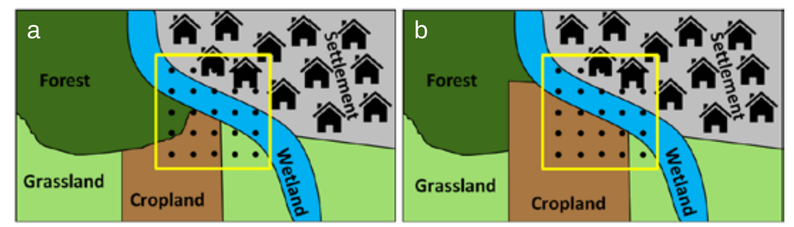
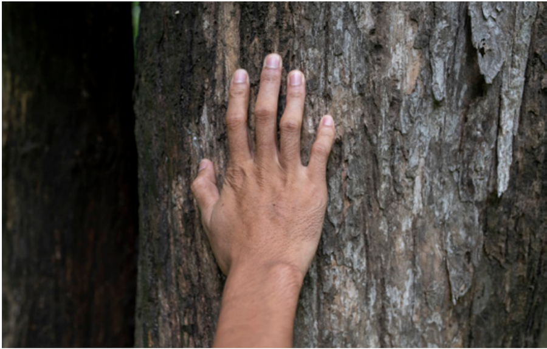
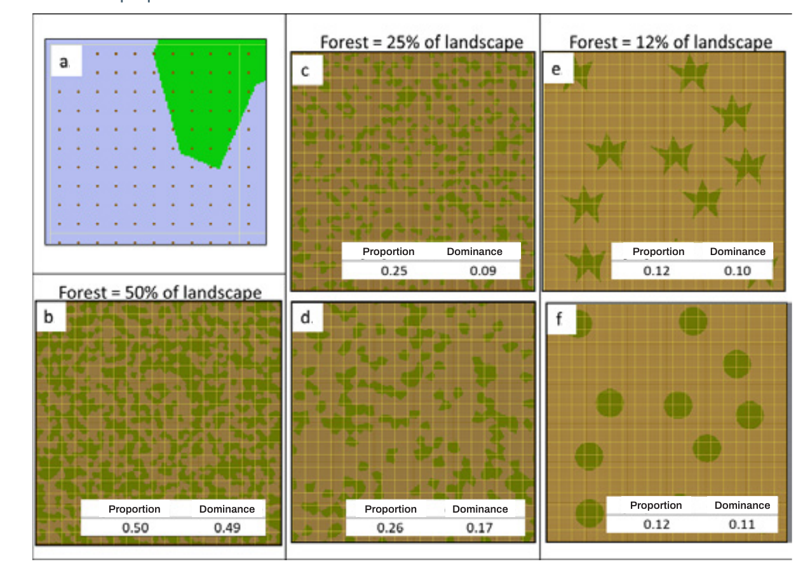
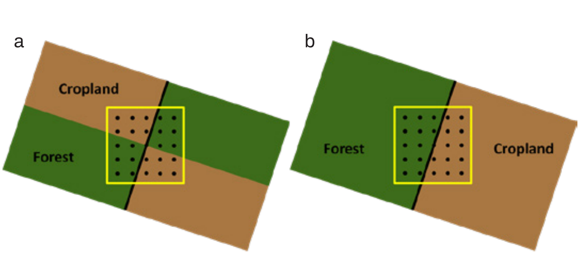

<!-- PDF page 73 | printed page 61 -->

## 3.3 Labelling protocols and sample unit data summarization

by

*Paul Patterson, Frédéric Achard, Andrew Lister and Randy Hamilton*

This section discusses the pros and cons of three protocols sometimes used to label the land use and land cover of area-based sample units (or plots) by interpreting a set of points within the sample unit. These include: i) assigning a single dominance class to the sample unit; ii) recording the land use proportions for each sample unit; or iii) recording and maintaining the point-level land use and land cover labels, such as using the Open Foris Collect Earth Online (CEO) tool, which allows point-level tracking through time.

#### Dominance class

In the case of assigning a dominance class, a single land use class is assigned to each plot based on a set of predefined rules, and the land use classes are often interpreted without context (see Section 3.4). For example, Bastin *et al*. (2017) promoted determining dominance class (predominant land use) using a hierarchy rule. “Predominance” is understood here to refer to a given land use category exceeding a predetermined threshold of the plot area; additional hierarchy rules also apply. For example, the percent occupancy threshold could be 30 percent with the following hierarchical order to apply in the case of ties: forest, cropland, grassland, settlement, wetlands and other lands. In Figure 9a, forest, cropland, grassland, and settlement occupy less than 30 percent of the plot, and wetlands are greater than 30 percent; therefore, this plot would be classified as dominance class wetlands. Countries using a dominance class approach may use different thresholds as well as different interpretation rules than those illustrated in Bastin *et al*. (2017).

**Figure 9** Comparison of a land use mosaic in Time 1 (a) and Time 2 (b) showing cropland expansion

**Source:** Authors’ own elaboration.

It is important to note that the estimates of the area or percent composition of each class in the population, based on a dominance approach, have different meanings than those based on recording land use proportions or retaining point-level land use calls within the plots. For example, an estimate of the proportion of forest calculated from dominance class plots must be interpreted as the proportion of locations on the landscape where a plot centred at that location is covered by at least 30 percent forest – while the estimate of cropland, for example, would be the proportion of the locations on the landscape for which a plot centred at that location would be covered by less than 30 percent forest and greater than 30 percent cropland. The estimate of forest (or any other land use) calculated in this fashion does not translate to an estimate of the true percent forest (or other land use) cover in the landscape, which is what would be expected from the other two labelling protocols. It is critical to understand and correctly interpret this difference in meaning of the estimates.

<!-- PDF page 74 | printed page 62 -->

One drawback of using the dominance class paradigm is that a small shift in the land classes on the plot can lead to a radical change in the dominance class of the plot. For example, Figure 9 shows cropland increasing between Time 1 and Time 2 at the expense of forest and grassland. As a result, the dominance class, due to the hierarchy rules, changes from wetland to cropland; however, the same proportion of the plot as before is wetland and in reality, no change in wetland occurred. In addition, a small amount of deforestation occurred, which was not detected.

There are other possible drawbacks to assigning dominance classes. First, subtle changes in the land use composition in the plot, such as from 35 percent forest coverage to 29 percent coverage, can cause the dominance class to change, and depending on the number of such changes, could cause inflated estimates of change. Second, and in a contrary manner, some large changes (for example, from 100 percent forest coverage to 31 percent coverage on the sample unit) will not lead to a change in dominance class, and thus will be undetected.

It can be shown that in certain landscape configurations, considerable differences can exist between estimates based on dominance class versus those calculated from the points within the plots and plot-level proportions. To illustrate, consider the results of the experiment depicted in Figure 10. In it, a population consisting of 361 hectares was constructed. A grid of plots, each 100 m × 100 m, was overlain on the population. Within each plot, a grid of 100 points was superimposed as shown in Figure 10a, and each point was labelled with a forest or non-forest class based on the type of patch it intersected. Several landscape types with different proportions of forest and forest patch configurations were generated within the population boundary (Figure 10b–f). Population estimates of forest proportion were calculated using both the dominance class and proportion approaches. In the case of dominance class, each plot received a 1 (present) or a 0 (absent) for the class of interest, with dominance based on > 50 percent occupancy. Using the proportion approach, each plot received a proportion of each class based on the proportions calculated from the point counts.

The results of this study, which are only based on one realization of the experiment, suggest that the proportion approach more closely reflects the true proportion of the forest class than the dominance approach, and that the differences are related to some combination of the proportion of the landscape occupied by the class of interest and the patch size and configuration. Proportions of classes that occur in smaller (relative to the plot size), more isolated patches appear to be prone to greater differences than classes occurring in larger, contiguous patches. Therefore, the results suggest that more research is needed on this important topic, and that considerable differences in the estimates or variances from the two approaches can occur.

<!-- PDF page 75 | printed page 63 -->

**Figure 10** Design and results of a simulation experiment for population estimates of the proportion of the forest

**Notes:** Design and results of a simulation experiment in which a grid of 100 points is superimposed on each of a set of 361 100 m × 100 m plots. Population estimates of the proportion of the forest (green) class were calculated using two methods: i) the proportion approach, in which each of the 100 points was labeled with a cover class, and the proportion forest was assigned to each plot; and ii) the dominant cover class on each plot was determined based on point counts, and for estimates of forest, 1 (present) or 0 (absent) was assigned to each plot. Means from the set of 361 plots were calculated and are presented in the tables at the bottom of each landscape image. The figure is divided into the following parts: a) a depiction of the 100 points superimposed on one plot, with the class of interest (green) indicated in the upper right; b) a simulated landscape that is 50 percent forest; c) a simulated landscape that is 25 percent forest, with small, isolated patches; d) a 25 percent forest landscape with larger, more contiguous patches; e) a 12 percent forest landscape with star-shaped patches to assess the effects of elongated patches; and f) a 12 percent forest landscape with round patches, assessing effects of compact patches.

**Source:** Authors’ own elaboration.

It is also important to reiterate, as mentioned previously, that estimates based on dominance are not directly comparable to those based on proportions from point-level data. In addition, dominance class estimates cannot be directly interpreted as estimates of the true proportion of the attribute of interest, but rather as the proportion of locations on the landscape where a plot centred at that location is covered by (in this case) more than 50 percent of the attribute of interest. In cases where the dominance threshold is significantly greater or less than 50 percent, the difference between the approaches would be expected to be even greater.

#### Land use proportions

Recording the land use proportions within the plots significantly increases the amount of detail about the composition of the landscape. Unlike the dominance class approach, estimates of forest (or other land use) can be interpreted as the proportion of that land use occurring in the landscape. However, with only proportions recorded at the plot level, some types of change can go unnoticed. For example, there is a possibility of missing reciprocal changes that occur within sample units. In Figure 11, the proportion of cropland (50 percent) and secondary forest (50 percent) in the sample

<!-- PDF page 76 | printed page 64 -->

unit is the same in both Time 1 and Time 2. If only proportions are recorded, it would appear that no change occurred. However, in reality, 25 percent of the secondary forest remained secondary forest, 25 percent of the cropland remained as cropland, 25 percent of the secondary forest transitioned to cropland, and 25 percent of the cropland transitioned to secondary forest, which yields a far different carbon accounting result. In other plots with even more land uses present, with some or all of them changing, it can be impossible to know what land use transitioned to what with only the Time 1 and Time 2 proportions. Because of this, only net population-level changes can be accurately calculated from these data. Therefore, this approach is not recommended for estimating forest emissions and removals, which should ideally be based on gross changes.

**Figure 11** Hypothetical scenario showing two properties

**Note:** In Time 1 (a), each property is half cropland and half secondary forest. After a number of years, in Time 2 (b), the cropland in the left property has regenerated to secondary forest, while the secondary forest in the property to the right has been cut to become cropland. In the sample unit, the proportions of the two land uses remains the same.

**Source:** Authors’ own elaboration.

#### Point-level land use information

The third option of recording and maintaining point-level land use and cover labels provides the most exact information and allows reciprocal and other within-plot land use transitions to be tracked with exactness. In Figure 11, for example, this approach would allow point-level changes to be tracked to correctly identify that 25 percent of the sample unit was deforested and 25 percent regenerated, and that the remaining land uses remained stable. Therefore, when feasible, it is recommended to record the land use calls for each point within each plot. If the point values are recorded at Time 1 and Time 2, the gross proportions of each change category can be calculated per plot and summarized to generate gross population-level estimates for each change category. The Open Foris Collect Earth Online tool18 permits point-level calls to be recorded. Although this method is recommended, one challenge of recording point-level information is that image shift from Time 1 to Time 2 can make it appear that change has occurred when it has not. Ideally, interpreters should view the Time 1 and Time 2 imagery simultaneously to mentally compensate for any image shift that occurs to ensure that the correct calls are made for each point.

<!-- PDF page 77 | printed page 65 -->

### References

Bastin, J.F., Berrahmouni, N., Grainger, A., Maniatis, D., Mollicone, D., Moore, R., Patriarca, C. *et al.* 2017. The extent of forest in dryland biomes. *Science*, 356(6338): 635–638. https://doi.org/10.1126/science.aam6527

---

18 See http://www.openforis.org/tools/collect-earth-online.html
