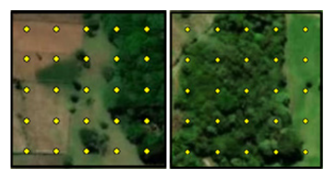
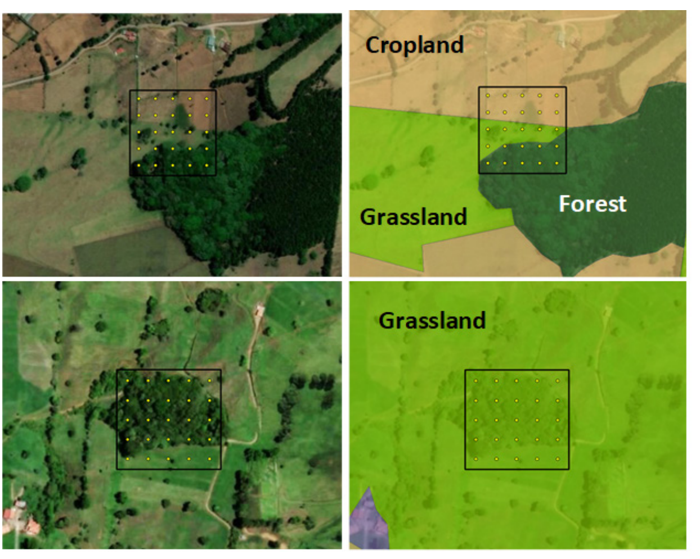

<!-- PDF page 79 | printed page 67 -->

## 3.4 Interpretation paradigms: Interpretation without or with context

by

*Randy Hamilton and Paul Patterson*

Sample-based area estimation has been implemented using a variety of sample unit designs, labelling protocols and interpretation rules. Unfortunately, these varied approaches can sometimes lead to very different results. Several sample unit designs and the implications of different labelling protocols were discussed in a previous GFOI white paper (GFOI, 2018). In this section we will focus on the interpretation rules (including the application of the forest minimum map unit component of the forest definition) associated with the particular case of interpreting points within a plot to determine the land use. Two basic types of interpretation rules have been implemented, which will be referred to as interpreting the land use without or with context.

#### Interpretation without context

In the case of interpretation without context, the sample unit would typically be the size of the minimum area or minimum map unit of the forest definition (or in some cases larger). The interpreter determines whether the sample unit is forested by assessing whether the amount of tree cover within it meets or exceeds the forest canopy cover definition and ideally that the other components of the forest definition are met (Figure 12). This determination is made without considering the land uses and patterns outside of the sample unit. In other words, the forest definition is applied with the sample unit as the frame of reference for the minimum map unit rather than with the irregular landscape patterns as the frame of reference. If the minimum canopy cover threshold within the sample unit is met, the entire sample unit is considered to be forest. Simple classification rules, like those of Bastin *et al*. (2017), can be used to label the sample unit with a dominance class (see Section 3.3 for a discussion of this approach).

**Figure 12** Assessing interpretation without context

**Notes:** When interpreting without context, the interpreter only considers the landscape within the sample unit. In this example, the sample units are 2 ha in size and the forest definition requires canopy cover greater than or equal to 60 percent with a minimum map unit of 2 ha. In the upper figure, 36 percent (9 of 25 points) of the sample unit has tree cover; therefore, this sample unit would be considered non-forest In the lower figure, 76 percent (19 of 25 points) of the sample unit has tree cover; therefore, this sample unit would be considered forest.

**Source:** Authors’ own elaboration.

Interpretation without context could be difficult to apply in multipurpose monitoring systems where other land uses, with their own cover and minimum map unit definitions, must also be applied and reconciled with each other. Under certain conditions, this approach could also lead to results considerably different from those obtained from interpreting each point within a plot with context (these differences are explained in more detail in Section 3.3). For example, consider a scenario with a forest definition of 30 percent canopy cover in a highly fragmented landscape that only contains small patches of trees, most of which are smaller than the forest definition minimum map unit size. In this scenario, applying the minimum map unit definition to

<!-- PDF page 80 | printed page 68 -->

the individual patches would show very little forest, while applying the minimum map unit definition to the sample unit could result in a much higher estimate of forest (see Section 3.3 on dominance class for a description of the subtle differences on how these two estimates differ and should be interpreted).

#### Interpretation with context

In the case of interpretation with context, the interpreter examines the patterns of land use both within and without the sample unit, and mentally delineates (or delineates in a Geographical Information System) boundaries around the different land uses, while applying their respective definitions such as minimum area, canopy cover (in the case of forest), and potentially minimum widths (Figure 13). In this case, the land use definitions are applied with the landscape patterns as the frame of reference. The corresponding land use is then assigned to the points within the sample unit to determine the proportion of each land use within the sample unit. In general, interpretation with context will provide a more exact estimate of the areas of the different land uses than interpretation without context. Furthermore, using the paradigm with context aligns with the intuitive, traditional concept that land uses occur in patches, or functional units, rather than the elemental landscape unit being an arbitrary, square-shaped unit (or a unit of any shape).

**Figure 13** Assessing interpretation with context

**Note:** When interpreting with context, the interpreter considers the landscape within and without the sample unit and applies the land use definitions to the patterns in the landscape. The plot locations in this figure are the same as in Figure 12. Just as in Figure 12, the sample unit is 2 ha in size and the forest definition requires canopy cover greater than or equal to 60 percent with a minimum map unit of 2 ha. In the upper figures, the land use within the sample unit is a mix of grassland (24 percent), cropland (40 percent), and forest (36 percent). In the lower figures, the patch of trees does not reach 2 ha; therefore, the land use is considered grassland. Note how different the land use calls are for interpretation with context versus without context (compare to Figure 12).

**Source:** Authors’ own elaboration.

<!-- PDF page 81 | printed page 69 -->

### References

Bastin, J.F., Berrahmouni, N., Grainger, A., Maniatis, D., Mollicone, D., Moore, R., Patriarca, C. *et al.* 2017. The extent of forest in dryland biomes. *Science*, 356(6338): 635–638. https://doi.org/10.1126/science.aam6527

GFOI (Global Forest Observations Initiative). 2018. *Summary of country experiences and critical issues related to estimation of activity data*. GFOI. https://www.reddcompass.org/mgd/resources/GFOI-MGD-3.1-en.pdf
