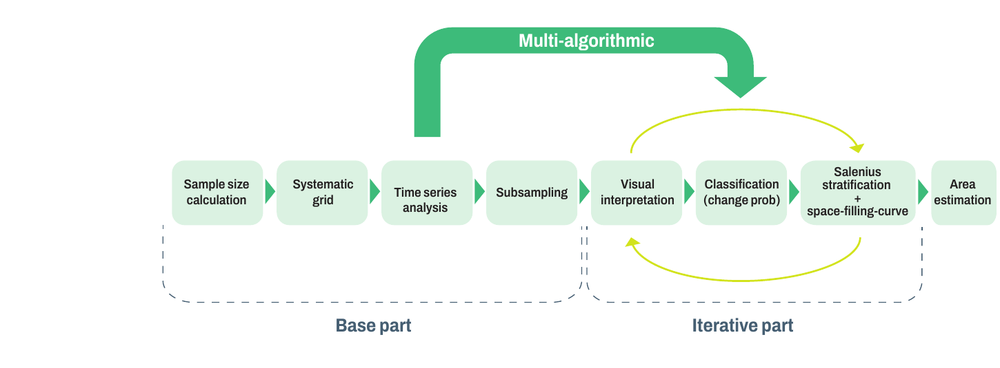
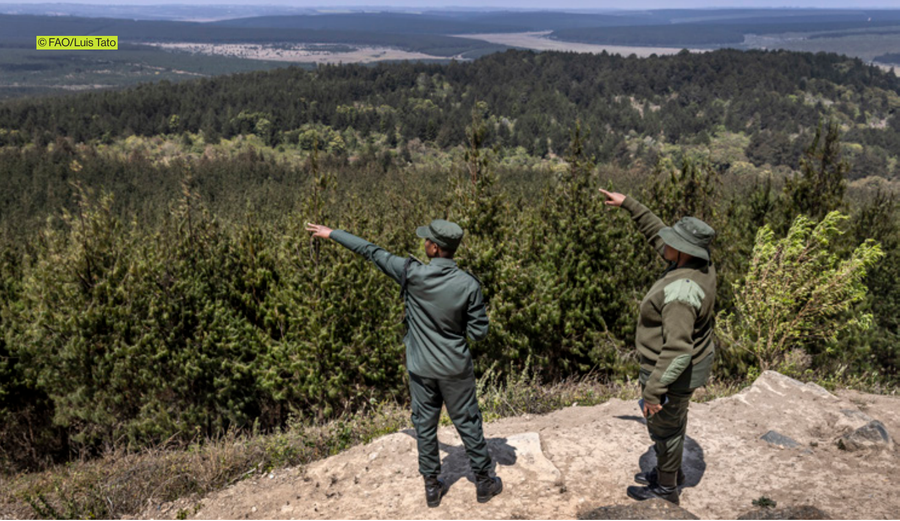

<!-- PDF page 93 | printed page 81 -->

# 5 Way forward

by

*Rémi d’Annunzio, Andreas Vollrath and Erik Lindquist*

<!-- PDF page 95 | printed page 83 -->

While stratified area estimation (SAE), or the practice of using a classified map to design a reference sample, has been widely recognized as a standard for producing results in accordance with best practices (Stehman, 1997; Olofsson *et al.*, 2013, 2014), using a random distribution of optimally allocated sample units can generate misleading results due to errors of omission of mapped deforestation (Olofsson *et al.*, 2020).

Practical solutions to the problems caused by errors of omission of change in a stratified area estimation approach imply exceptionally large sample sizes that are time consuming to analyse manually and thus make visual interpretation of each sample unit often not feasible given the tight time limits normally required for reporting. Time-consuming though it may be, results obtained with a large reference sample will be more precise than with a small sample.

To ease the burden of reference sample interpretation and decrease the time required to produce results, ensemble sample-based area estimation (eSBAE) has been developed and is tested in different pilot countries. It consists of a hybrid approach for area estimation, combining visual interpretation and machine learning. The proposed hybrid approach incorporates improvements to various aspects throughout its full workflow, aimed at optimizing the sample size.

**Figure 14** Workflow to implement ensemble sample-based area estimation

**Source:** Authors’ own elaboration.

Capturing unbiased area estimates of rare events, such as deforestation and forest degradation, with low levels of uncertainty, requires large sample sizes regardless of the sampling design (Pagliarella *et al*., 2018) and the area covered. However, manually interpreting the samples is time-consuming and often not possible within reporting deadlines. To address this, FAO suggests a set of tools that optimize sample selection for visual interpretation. Throughout the last year, this procedure has been piloted in several countries, resulting in a significant reduction in effort to achieve acceptable levels of uncertainty without introducing further bias.

The starting point of this approach is a very dense systematic grid (1 km × 1 km or 2 km × 2 km spacing). In a subsequent step, a unique probability of forest change is assigned to each sample using auxiliary data sources from global products in combination with data-driven information extraction routines (such as time-series analysis), which can potentially include national maps and information layers. This process, known as ensemble classification or stacking, improves the distinction between stable and changing forest areas (Healey *et al*., 2018) – hence ensemble SBAE. Unlike the discrete classification of stable and unstable forest classes used in stratification for stratified area estimation (Stehman, 1997; Olofsson *et al*., 2013, 2014), the continuous variable of forest change probability from the ensemble classification process is utilized, allowing for a gradual representation of change likelihood over the entire area.

<!-- PDF page 96 | printed page 84 -->

It turns out that the statistical distribution of forest change probability for all samples is heavily skewed toward low probabilities, as most samples are in core forest areas or areas outside forests. An optimized framework for subsampling such distributions is known as the Dalenius type of stratification, followed by Neymann allocation for sample selection (Hidiroglou and Kozak, 2018). The samples are selected in a spatially balanced way, using the concept of a space-filling curve (Lister and Scott, 2009). One advantage of this workflow is that the final stratum of a high-likelihood of change is usually larger compared to maps of change and no-change making omissions in the large no-change stratum highly unlikely. Omission errors have been a major concern for stratified area estimation (Olofsson *et al*., 2020), as even a few of them result in elevated levels of uncertainty due to their huge weight. In contrast, the eSBAE workflow targets a clean stable stratum free of omissions. This may lead to higher uncertainties in the change strata, as sample weights are initially higher. However, reducing uncertainty now can be achieved more rapidly by intensifying on change stratum, where less points are present. The FAO Forestry Division is developing a series of notebooks from the Open Foris initiative to implement this approach using Jupyter notebooks on the System for Earth Observation Data Access, Processing and Analysis for Land Monitoring (SEPAL) platform (SEPAL, 2023). Parts of the process can also be used to prioritize sample selection for QA/QC or to support intensified sampling in stable strata using stratified area estimation.

<!-- PDF page 97 | printed page 85 -->

### References

Healey, S.P., Cohen, W.B., Yang, Z., Brewer, C.K., Brooks, E.B., Gorelick, N., Hernandez, A.J. *et al.* 2018. Mapping forest change using stacked generalization: An ensemble approach. *Remote Sensing of Environment*, 204: 717–728. https://doi.org/10.1016/j.rse.2017.09.029

Hidiroglou, M.A. and Kozak, M. 2018. Stratification of Skewed Populations: A Comparison of Optimisation-based versus Approximate Methods. *International Statistical Review*, 86(1): 87–105. https://doi.org/10.1111/insr.12230

Lister, A.J. and Scott, C.T. 2009. Use of space-filling curves to select sample locations in natural resource monitoring studies. *Environmental Monitoring and Assessment*, 149(1–4): 71–80. https://doi.org/10.1007/s10661-008-0184-y

Olofsson, P., Foody, G.M., Stehman, S.V. and Woodcock, C.E. 2013. Making better use of accuracy data in land change studies: Estimating accuracy and area and quantifying uncertainty using stratified estimation. *Remote Sensing of Environment*, 129: 122–131. https://doi.org/10.1016/j.rse.2012.10.031

Olofsson, P., Foody, G.M., Herold, M., Stehman, S.V., Woodcock, C.E. and Wulder, M.A. 2014. Good practices for estimating area and assessing accuracy of land change. *Remote Sensing of Environment*, 148: 42–57. https://doi.org/10.1016/j.rse.2014.02.015

Olofsson, P., Arévalo, P., Espejo, A.B., Green, C., Lindquist, E., McRoberts, R.E. and Sanz, M.J. 2020. Mitigating the effects of omission errors on area and area change estimates. *Remote Sensing of Environment*, 236: 1–9. https://doi.org/10.1016/j.rse.2019.111492

Pagliarella, M.C., Corona, P. and Fattorini, L. 2018. Spatially-balanced sampling versus unbalanced stratified sampling for assessing forest change: evidences in favour of spatial balance. *Environmental and Ecological Statistics*, 25(1): 111–123. https://doi.org/10.1007/s10651-017-0378-y

SEPAL (System for Earth Observation Data Access, Processing and Analysis for Land Monitoring). 2023. eSBAE notebooks. In: SEPAL documentation. Cited 5 September 2023. https://github.com/sepal-contrib/eSBAE_notebooks

Stehman, S.V. 1997. Estimating standard errors of accuracy assessment statistics under cluster sampling. *Remote Sensing of Environment*, 60(3): 258–269. https://doi.org/10.1016/S0034-4257(96)00176-9
