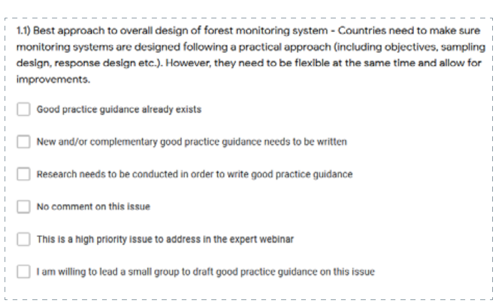
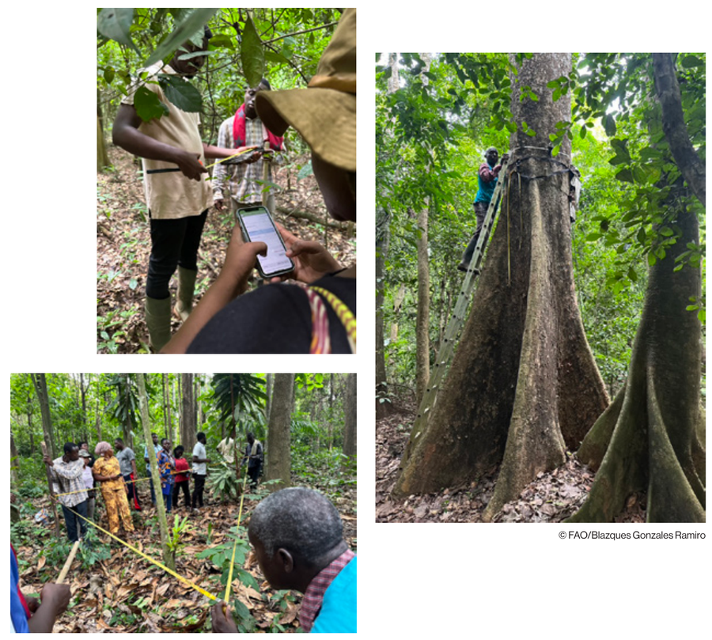

<!-- PDF page 106 | printed page 94 -->

## Annex II Baseline surveys and results

This paper was written based on: i) three surveys of experts to prioritize issues; ii) online meetings with experts to discuss issues; and iii) expert input to form sections. This annex presents the full list of topics included in the surveys, to give a fuller picture of the subject of area estimation as it stands and serves as a background to document how this paper was written. The three surveys were structured as follows: each issue that had been identified as of potential interest or importance was briefly described and respondents were asked to agree or disagree with six statements in relation to the issue (see Figure A2.1), which enabled prioritization of issues for inclusion in this paper.

**Figure A2.1** Screenshot of survey question indicating how the issue of interest was presented

**Source:** Authors’ own elaboration.

### General design issues

#### General design of monitoring system

- **Best approach to overall design of forest monitoring system** – Countries need to make sure natural monitoring systems are designed following a practical approach (including objectives, sampling design, response design, etc.). However, they need to be flexible at the same time and allow for improvements.

#### Considerations for multipurpose monitoring

- **Considerations for multipurpose monitoring** – Sampling should be useful for other purposes beyond area estimation. What are the considerations? Are there good practice recommendations?

- **Integration of monitoring components** – Ideally all monitoring components should be integrated (for example, NFI with area estimation).

<!-- PDF page 107 | printed page 95 -->

- **Monitoring for degradation, afforestation, etc.** – Development has typically focused on deforestation and less on degradation, afforestation, reforestation and carbon enhancement (SMF and conservation). What adjustments need to be made to adequately monitor these other activities?

- **Value of maps** – Don’t devalue maps too much. They are important for planning and other activities, not just for area estimation. How can mapping classification uncertainty be used for reporting or planning?

#### Issues related to varying dates and qualities of imagery for mapping and/or visual interpretation

- **Lack of or gaps in high-resolution imagery** – High-resolution imagery is frequently not available for all parts of a country and may have a cost implication. What can countries do if there are gaps in the fine-resolution coverage or if it is not available at all?

- **Missing data** – Missing data (for example, due to clouds, shadows, lack of recent imagery)

- **Mixed-resolution imagery** – When full-coverage fine-resolution is not available, countries will interpret plots from both fine- and moderate-resolution imagery. What are the implications of this practice? What are good practice recommendations?

- **Impacts of widening date range of imagery** – Countries frequently widen the date range for interpreting the imagery to +/- 1 year, +/- 2 years, etc. to ensure all plots are interpreted. What are the impacts and recommendations?

- **Date mismatches: Strata versus reference data** – Mismatch of the dates of imagery used to create a stratification map and the dates of imagery of the reference data frequently occur. May this be a source of omission errors? What guidance can be recommended?

- **Impacts of improved temporal resolution** – Improvements in temporal resolution may lead to increased omission errors. What can be the incentive for countries to improve in this regard?

- **Impacts of improved spatial and temporal resolution** – Improvements in spatial and temporal resolution may lead to increased detection of deforestation and higher deforestation rates. Therefore, there may be no incentive for countries to improve in this regard, especially if the increased spatial and temporal resolution is not available for both the reference and monitoring period.

- **Data from NFI versus from remote sensing** – Even when it is not very common, some countries already have permanent NFI plots, that are revisited at regular intervals, and can those provide better information on activity data than remote sensing?

- **Maintaining consistency as imagery improves** – Imagery improves through time. Should countries change image sources as new/better image sources become available? How can this be done while maintaining data consistency? Would it be worthwhile to run a Landsat-based and fine-resolution imagery-based system in parallel to calibrate against, providing a consistent basis to compare against?

#### Lack of capacities

- **Lack of statistical expertise** – Countries need to involve experts in statistics, but they are not always involved in the design; usually good expertise in remote sensing but not in sampling design or statistical analysis.

- **Need for local capacities** – Local capacities are indispensable to make monitoring systems sustainable in the long term. Is there more that can be done to ensure the proper capacities are developed?

- **Lack of documentation standards** – Not all countries have proper documentation and data archiving of processes allowing reconstruction of results. What can be done to encourage improvement in this regard?

- **Lack of SBAE expertise** – In some regions it can be very challenging to find experts who can correctly implement SBAE. There may be a trade-off between complexity and transparency. For example, they may implement a complex approach, but depend on external consultants to explain it. What can countries do that lack adequate local expertise?

- **Developing monitoring capacity in other sectors** – Forest monitoring is moving forward and improving, but other sectors are not. Is there more that should be done to develop consistent methodologies for these other sectors?

<!-- PDF page 108 | printed page 96 -->

Choosing the most appropriate tool for local needs and conditions ¢ Choosing the most appropriate tool – There are different tools available, each one has its pros and cons. Are those pros and cons well understood by countries? How can countries make informed decisions? ¢ Lack of or poor-quality internet – Limited internet availability and bandwidth is an issue for some countries, which can significantly impact the use of image streaming services such as Planet data and also the use of tools such as Collect Earth or Collect Earth Online. What can be recommended to countries having these limitations? Guidance and/or comments:

### Quality assurance/quality control

Good practices for quality assurance/quality control ¢ Incomplete implementation of QA/QC – Countries sometimes implement only some parts of the QA/QC process and usually not from the beginning. What can be done to help countries better implement QA/QC? ¢ Lack of good practice guidance – There is not detailed good practice guidance on QA/QC for all the possible processes in a monitoring system. Can additional good practice guidance be developed?

Interpreter error ¢ Assessing and using interpreter error – There is somewhat limited guidance on how to characterize interpreter error and how to use the resulting data. Additional guidance is needed. ¢ Integrating interpreter error into overall uncertainty estimates – Some countries are quantifying interpreter error (such as using within and cross-interpreter interpretations), but not integrating it into the overall error. How can the interpreter error be integrated in the uncertainty analysis? Countries have no incentive to integrate interpreter error because it will increase the uncertainty of the estimates and may reduce their payments.

### Reporting

Better communicating and addressing reporting inconsistencies ¢ Reconciling differences between SBAE and maps – Many countries that use SBAE also create maps. Area estimates from the two products will differ and may create confusion, because countries need to publish shape files or raster due to transparency issues. Inconsistencies in areas reported by maps versus samples can also be difficult to explain and difficult for decision-makers to accept. ¢ Value of maps – Maps are used for many purposes other than stratification. ¢ Addressing inconsistencies due to improvements – Making improvements while still maintaining consistency can be challenging. For example, how can finer-resolution imagery for recent periods be combined in a compatible way with coarser-resolution historical imagery? When the improvement enhances the accuracy, countries must make decisions on whether to prioritize consistency or accuracy. ¢ Incomparable data due to different definitions – Currently countries use vastly different definitions that make the data incomparable between countries.

#### Incentivizing countries to produce more complete and transparent reports

- **Integrating more sources of error** – Is reporting more sources of error disincentivized by donors? Are policy changes needed?

- **Transparency and data sharing** – Transparency and data sharing can sometimes be an issue (such as coordinates of random plots). How can these be improved?

<!-- PDF page 109 | printed page 97 -->

#### Difficulties of characterizing land use change over short periods of time and variable reporting requirements

- **Higher uncertainty due to reduced deforestation** – If a country reduces deforestation, this means it becomes a rarer feature over the results period and therefore the error of the estimates increases.

- **Difficulty of measuring land use change over short periods** – There is a mismatch in mandates (for example, UNFCCC and Forest Carbon Partnership Facility [FCPF] ask for reports each year or every two years, respectively) and guidelines (for example, IPCC asks for land use change). It is difficult to characterize land use change over short periods; therefore, land cover change is generally reported. Adequately characterizing land use change requires the analysis of longer time series.

### Sampling design issues

#### Good practices for stratified area estimation

- **Omission errors in stable classes** – What are recommended approaches to deal with omission errors occurring in large stable classes, which significantly increase the error of the estimates?

- **Buffering approaches** – Countries are using different approaches to develop buffers to capture omission errors (for example, Peru is using Morphological Spatial Pattern Analysis and Colombia is using deforestation risk). What are recommended approaches?

- **New stratification versus updating a base map** – Some countries create a new stratification map for each reporting interval (with a new set of sample units) while others have created a very high-quality base map that is updated through time. In the latter case, new sample units are added in areas of change and existing sample units are reevaluated. What are the pros and cons of the two approaches and using temporary versus permanent sample units?

- **Sources of stratification** – Some countries lack the capacity to develop their own change maps but need a reliable source of stratification for area estimation. What are recommended alternatives?

- **Challenges of global maps for stratification** – In some countries such as areas with dry forest, global products have very low accuracy because they have been calibrated using training data from humid and dense forests. What can be done in these cases?

- **Recreating strata until desired results achieved** – Some countries have created new stratification maps when omission errors are detected by stratified sampling to avoid the associated penalization. Is this valid? What are the implications of this practice?

- **Applying new strata to existing pre-stratified samples** – Some countries are creating new stratification maps and applying them to a sample that was stratified using a different map. What are the implications of this practice?

- **Number of sample units required in stable strata (issue 1 of 2)** – How many sample units are needed in stable classes to verify that there are no errors of omission?

- **Number of sample units required in stable strata (issue 2 of 2)** – How many sample units are needed in the stable classes to reduce the weight of errors of omission of rare classes (especially since deforestation may be rare)? Is there a minimum sample size in the stable classes to be safe?

- **Strata labels versus reference levels** – Do map classes and labels for stratification have to match the phenomena that are being measured? For example, if deforestation is being estimated, do the strata have to be derived from wall-to- wall information on deforestation?

- **Sample units crossing strata boundaries** – Countries have encountered situations in which a sample unit falls near a boundary and overlaps into one or more strata. How should they handle the situation? This is especially relevant when using a rare class as a stratum.

<!-- PDF page 110 | printed page 98 -->

- **Sample allocation to strata** – What is the best way to allocate sample units to strata (equal, optimal, etc.)?

- **Arbitrary stratification** – Some countries are selecting somewhat arbitrarily the areas in which to intensify their sample. What are the implications of this practice?

- **Overlapping samples** – occasionally two random sample units may overlap. How should this be handled? Keep both or throw one away?

- **Rule‑of‑thumb for stratification map accuracy** – Sometimes accuracy of a change map appears to be extremely low after a stratified area estimate is obtained. Is there a rule‑of‑thumb for minimum user accuracy/producer's accuracy of the change class for a map to be an efficient stratifier?

#### Stratified versus systematic area estimation

- **Stratified versus systematic area estimation** – Some countries are unsure about whether stratified or systematic area sampling is better. What are the pros and cons of the two approaches?

- **Preferred design for REDD+ and greenhouse gas only** – If a country is interested in designing a monitoring system for only REDD+ and greenhouse gas reporting, is there a preferred design?

- **Preferred design for multipurpose monitoring** – What is the recommended sample design for a multipurpose monitoring system? For example, what is the best sample design?

- A base reinterpreted systematic grid coupled with a stratified intensified sample of temporary systematic sample units.
- A base reinterpreted systematic grid coupled with a nested, wall-to-wall intensified grid in which every sample unit is visually reviewed, but only those containing change are recorded.
- A stratified sample of a very high-quality base map in which the base map is updated in each reporting cycle with change areas. The original sample units are reinterpreted, and new sample units are added to the change areas, which also are reinterpreted through time.
- Post-stratifying the base systematic grid using a change map.
- New samples are drawn from new change maps each reporting cycle (temporary sample units in each cycle).
- Other?
Temporary versus permanent reference samples

- **Temporary versus permanent interpreted sample units** – When is it best to use temporary sample units (interpreted for a single reporting period) versus permanent sample units (reinterpreted through time)? What are the considerations related to stratified versus systematic sampling? For REDD+ and greenhouse gas reporting, how important is it to use permanent image plots (sample units) to facilitate comparisons among all monitoring events? What needs beyond REDD+ require data from permanent sample units?

- **How to use permanent sample units in stratified area estimation** – Permanent sample units can be challenging to work with in stratified area estimation. If permanent sample units are required, what is the best design and approach to use them efficiently?

- **Temporary sample units and double counting** – How can double counting of change (deforestation, reforestation, degradation, and enhancements) be avoided when the monitoring system uses temporary sample units for visual interpretation?

What are good practices for systematic area estimation?

- **Sampling intensity to achieve desired precision** – Countries frequently find that few samples fall in areas of change (such as deforestation) and sometimes use a grid density based on resources available (time, capacities, budget). What is the minimum density needed to capture the phenomena of interest (deforestation, degradation) with acceptable precision?

- **Adjustments for REDD+ and greenhouse gas reporting** – If a country wishes to use systematic sampling to satisfy other needs, what adjustments are needed to obtain the precision needed for REDD+ and greenhouse gas reporting?

<!-- PDF page 111 | printed page 99 -->

#### Other sample design issues

- **Finite versus infinite sampling paradigm** – Some countries have used a finite and others an infinite sampling paradigm. Is there a preferred approach? What are the pros and cons of the two approaches?

- **Subnational assessments** – Some countries are interested in doing subnational assessments. What good practices apply to these assessments (such as nesting approaches)?

- **Assessing carbon losses from deforestation** – Considering that post-deforestation land use has much larger uncertainties, when countries consider post-deforestation carbon contents in their emission factors, the emission estimates are affected by this assessment. The question then arises: should countries assess post-deforestation once and deduct a fixed quantity from the forest carbon stock to avoid overestimating emissions (and emission reductions) from deforestation, or should they assess this annually where this information may affect the quantity of emissions reductions?

- **Other sample designs** – Area estimation assumes normal distributions; should other distributions be considered (such as binomial)? Is there a need for more experimental design?

- **Country size considerations** – Countries vary vastly in size. Are some practices more applicable for larger or smaller countries? Is it easier to make a good map for a small country? Can mapping in a large heterogeneous area cause omission errors to be more likely?

- **Combining different sized sample units** – If sample unit size changes in the sample design, can a design with multiple sample unit sizes be used?

- **Impacts of sample unit size on sample design** – Does the sample unit size have any effect on the sample design? Can the sampling size be reduced if the sample unit size is very large?

### Response design issues

#### Designing the land use and land cover classification system(s) for reference data

- **Number of reference classes** – Some countries use only forest/non-forest classes, others use the IPCC classes, and others use additional, more detailed classes. What are the considerations and good practice recommendations?

- **Land use versus land use and land cover** – Some countries use only a land use classification system, others use both land use and land cover, and others use a single mixed land use and land cover system. What are the implications and the pros/cons? When would a country want to interpret both land use and land cover? For example, some countries have expressed interest in characterizing tree cover within pasture and agricultural land, which requires both land use and land cover.

- **Impact of imagery used for interpretation** – How do the spatial, temporal, spectral resolutions of the imagery available impact the design of the classification system?

- **Difficult land uses to interpret** – Some land use classes are difficult to identify and characterize, such as shifting cultivation systems that rotate between agriculture and forest. What are good practices related to class definitions and identifying these difficult land uses?

- **Number of forest classes** – How can a country find balance between the number of forest classes and the precision of the emission factors to optimize overall precision and minimize effort? For example, if a country has emission factors for various forest types, is it better to estimate the areas of deforestation for all forest types and apply the refined emission factors for each (this reduces the sample size in each class and increases sampling error), or lump the forest type classes to increase the sample size and improve the precision of the area estimates, but requiring the use of a less precise emission factor? How can a country find the optimal balance?

- **Assessing deforestation by forest type** – Many countries use different emission factors per forest type requiring activity data to be produced per forest type. What is the recommended approach to get deforestation estimates by forest type, by considering forest type in the sampling design as a stratification or can this information be assigned through labelling of the reference data?

<!-- PDF page 112 | printed page 100 -->

#### Defining the strata for stratified area estimation

- **Creating effective strata** – what are good practice recommendations for creating an effective stratification layer? How many strata?

#### Sample unit (plot) design

- **Point samples versus larger sample units or support regions** – Is it more efficient to use many single point (or pixel) sample units or fewer larger sample units (for example, 0.5 ha, 1 ha, 2 ha, 10 ha) containing multiple points per sample unit? This question encapsulates the question of generating binary versus continuous data at the level of the sample unit. What are the pros and cons? Is it worth the time and resources for a country to do comparison studies; would it ultimately improve their results?

- **Optimal sample unit size** – What considerations should be taken into account when determining sample unit size? What is the optimal sample unit size (for example, Landsat pixel, 1 ha, 2 ha, 5 ha)? How can optimal sample unit size be determined? What are the trade-offs? Should the sample unit size correspond to the minimal area in the forest definition?

- **Sample unit shape** – Does sample unit shape matter (for example, circular versus square versus hexagonal)? What factors should a country consider?

- **Image segments and polygons as sample units** – A few countries create maps for stratified area estimation using image segmentation. Can the segments be used as sampling units? What are the considerations and implications versus traditional point-type and plot-type designs? Can this approach be recommended?

- **Number of points per sample unit** – Countries using support region-based or plot-based samples use different numbers of points within the sample units. What are the pros and cons of higher or lower numbers of points? Is there an optimal number of points, how can it be determined and is it worth the effort?

- **Two-stage cluster design** – Can the points within sample units be used as a two-stage cluster design?

#### Interpretation paradigms

- **Degree of data summarization assigned to sample unit** – Countries use different sample unit interpretation paradigms when using sample units larger than a single pixel, such as: assigning only a dominance class to the sample unit; recording the proportions of all land uses and covers within the sample unit; or recording point-level land use and cover data (such as using the Open Foris Collect Earth Online tool). What are the key considerations, as well as pros and cons? Is there a recommended approach?

- **Interpretation with or without context** – Considering land use minimum area definitions, some countries interpret land use considering the context outside of the sample unit, while others do not. For example, if forest is defined as > 2 ha, and a small patch of forest falls in a sample unit, the sample unit is considered partially forested; the sample unit would be 2 ha in size and if the tree cover within the sample unit reaches the cover definition, the sample unit is considered forested whether or not the area of the patch of trees reaches 2 ha. What are the pros and cons? What are the recommended good practices? Implications of land use class definitions?

- **Assessing change not visible from imagery** – How can change that is not visible in most imagery be assessed, such as change occurring underneath a tree canopy?

- **Approaches to interpreting change across long intervals** – When interpreting change within long time periods (such as for a FREL), is it better to interpret only first and last dates and then record dates of change for sample units that change or interpret each time period within the range independently? For example, some countries first interpret the sample units at the beginning and end of the period and second, for sample units that have changed, they review a Landsat time series graph and/or other ancillary data to identify the year(s) in which change occurred. Other countries interpret all sample units for each date range of interest within the full range of dates. What are the pros and cons of the two approaches? Is one preferred over the other?

#### Definitions of forest, deforestation and degradation

- **Forest, deforestation, and degradation definitions** – Countries are applying widely varying definitions that are not necessarily comparable and may or may not be clearly defined or may not be defined such that they can be reliably identified. Also, some countries are using multiple definitions for different initiatives. What good practice guidance can be provided?

<!-- PDF page 113 | printed page 101 -->

