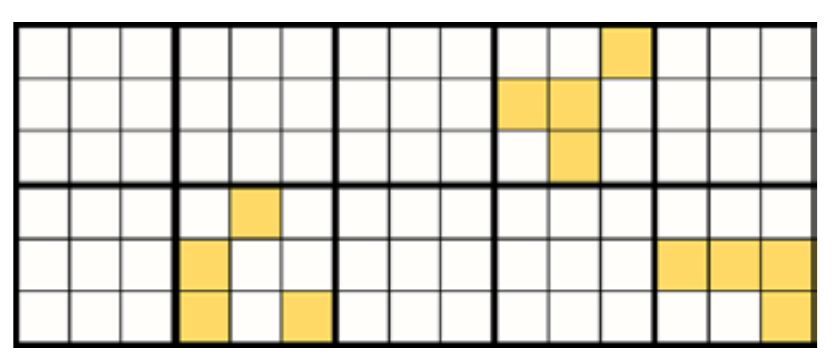
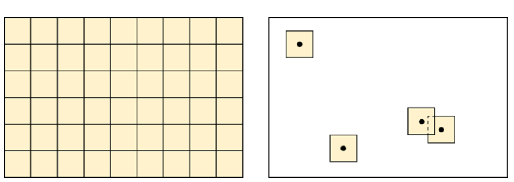

<!-- PDF page 100 | printed page 88 -->

# Annex

## Annex I Sampling strategies

by

*Paul Patterson and Andrew Lister*

This annex discusses the theoretical differences among the two-stage two-step and cluster sampling strategies presented in Section 2.5 for those who wish to understand the theoretical underpinnings in greater depth; however, the information presented in Section 2.5 will be sufficient for many practitioners. The discussion presented here is designed as an overview and tries to provide enough details without being a complete theoretical discussion; some results will be stated, with references cited for those who wish to see the details of the derivations. A subsection is dedicated to each of the strategies. Each of the subsections will cover simple random sampling and systematic sampling first, followed by stratification and post-stratification. Any notation defined in Section 2.5 will not be redefined in this part of the paper.

#### Two-stage sampling from a finite population

In two-stage sampling, the sample units are considered a first-stage sample of primary sampling units (PSUs). The PSUs are supposed to be disjointed and cover the region (tessellate the region). The number of PSUs that tessellate the region is denoted *N*; typically, this is the size of *R*, measured in appropriate units, divided by the size of the plot in the same units. The second stage is a sample of the population units that make up the PSU. The PSU contains *M* population units, and there are *m* population units sampled within each PSU (Figure A1.1).

**Figure A1.1** Two-stage sampling from a finite population

**Note:** Example of a population that has been tessellated by $N$ = 10 PSUs, denoted by the thicker lines. Each PSU contains $M$ = 9 population units. The sample shown here contains $n$ = 3 PSUs and within each PSU the sample contains $m$ = 4 population units.

**Source:** Authors’ own elaboration.

As already mentioned, the sample units are considered the PSUs and the points within a sample unit are considered the population units. For this to be a finite population the “points” must be two-dimensional instead of one-dimensional and these two-dimensional objects should tessellate the sample unit (in the literature these objects are referred to as secondary sampling units; here, we will continue to refer to them as points). For a derivation of the following results, see Sections 10.1–10.4 of Cochran (1977).

<!-- PDF page 101 | printed page 89 -->

The two-stage estimator of the proportion of the attribute of interest within the region $R$, denoted by $\hat{P}_R$, is:

$$
\hat{P}_R = \frac{1}{n}\sum_{i=1}^{n}\frac{1}{m}\sum_{j=1}^{m} y_{ij} = \frac{1}{n}\sum_{i=1}^{n}\hat{P}_i
\qquad \text{(Equation 15)}
$$

$\hat{P}_i = \frac{1}{m}\sum_{j=1}^{m} y_{ij}$ is an estimate of the proportion of the attribute of interest in the $ith$ PSU (sample unit) of the sample. Next is the equation of the variance of the estimator. Before giving the equation, a couple of items need to be defined. The PSUs are supposed to tessellate the region $R$. Let $i = 1 \ldots N$, denote the index of the $N$ PSUs that tessellate the region $R$ and let $P_i$ equal the proportion of the attribute of interest within the $ith$ PSU. If $N$ is much larger than $n$ and $M$ is much larger than $m$ then the two finite population correction factors, $\left(1 - \frac{n}{N}\right)$ and $\left(1 - \frac{m}{M}\right)$, are ignored and the variance of $\hat{P}_R$ is:

$$
V(\hat{P}_R) = \frac{1}{n}\frac{1}{N-1}\sum_{i=1}^{N}\left(P_i - P_R\right)^2 + \frac{1}{nm}\frac{1}{N}\sum_{i=1}^{N}\left(\frac{1}{M-1}\sum_{j=1}^{M}\left(y_{ij} - P_i\right)^2\right)
\qquad \text{(Equation 16)}
$$

The variance estimator, also ignoring the finite population correction factors, is:

$$
v(\hat{P}_R) = \frac{1}{n(n-1)}\sum_{i=1}^{n}\left(\hat{P}_i - \hat{P}_R\right)^2 + \frac{1}{Nn(m-1)}\sum_{i=1}^{n}\hat{P}_i\left(1 - \hat{P}_i\right)
\qquad \text{(Equation 17)}
$$

Since $0 \le \hat{P}_i \le 1$, the product $\hat{P}_i\left(1 - \hat{P}_i\right)$ is less than or equal to 0.25 and hence $\frac{1}{n}\sum_{i=1}^{n}\hat{P}_i\left(1 - \hat{P}_i\right)$ is less than or equal to 0.25. Considering this, if the number of PSUs, $N$, is large, the second term can be ignored and the following is used as the reduced variance estimator:

$$
v(\hat{P}_R) = \frac{1}{n(n-1)}\sum_{i=1}^{n}\left(\hat{P}_i - \hat{P}_R\right)^2
\qquad \text{(Equation 18)}
$$

In stratified two-stage sampling each stratum is sampled using an independent two-stage sample, which means that each stratum is tessellated by PSUs and each PSU is in one and only one stratum. In post-stratified two-stage sampling, the PSUs in the sample are assigned to a stratum after the two-stage sample is drawn. Each stratum is tessellated by PSUs in it and each PSU is in one and only one stratum. It is important to note that in practice it is not uncommon to find examples of PSUs crossing strata boundaries, which is a violation of the assumption. Practitioners who use a two-stage sampling strategy and stratification often assign the stratum encountered at an arbitrary point within the sample unit (such as the centre point) to the sample unit in both ground-based and image-based forest inventories. Although this violates a fundamental assumption, the impact is assumed to be minimal. The authors are unaware of any studies that evaluate this.

To simplify the formulas, the proportion of the attribute of interest in the $hth$ stratum will be denoted by $P_h$ and its estimate denoted by $\hat{P}_h$; $h = 1, H$. Also, for the $hth$ stratum, let $W_h$ equal the stratum weight, $Nh$ equal the total number of PSUs, $n_h$ the number of sample units (PSUs) in the sample, and $m$ the number of points sampled in each of the

sample units. Then the estimator for both stratified two-stage sampling and post-stratified two-stage sampling is given by:

<!-- PDF page 102 | printed page 90 -->

$$
\hat{P}_{RS} = \sum_{h=1}^{H} W_h\hat{P}_h = \sum_{h=1}^{H} W_h\left(\frac{1}{n_h}\sum_{i=1}^{n_h}\left(\frac{1}{m}\sum_{j=1}^{m} y_{hij}\right)\right)
\qquad \text{(Equation 19)}
$$

The variance of stratified two-stage sampling is denoted by $V_S(\hat{P}_{RS})$, and is given by:

$$
V_S(\hat{P}_{RS}) = \sum_{h=1}^{H} W_h^2 V(\hat{P}_h)
\qquad \text{(Equation 20)}
$$

$V(\hat{P}_h)$ is given by $V(\hat{P}_h) = \frac{1}{n_h}\frac{1}{N_h-1}\sum_{i=1}^{N}\left(P_{hi} - P_h\right)^2 + \frac{1}{n_h m}\frac{1}{N_h}\sum_{i=1}^{N}\left(\frac{1}{M-1}\sum_{j=1}^{M}\left(y_{hij} - P_{hi}\right)^2\right)$ with the finite population correction factors ignored. A variance estimator is given by:

$$
v_S(\hat{P}_{RS}) = \sum_{h=1}^{H} W_h^2 v(\hat{P}_h) = \sum_{h=1}^{H} W_h^2\left(\frac{1}{n_h(n_h-1)}\sum_{i=1}^{n_h}\left(\hat{P}_{hi} - \hat{P}_h\right)^2\right)
\qquad \text{(Equation 21)}
$$

The finite population correction factors are ignored and the second term of the traditional variance estimator is ignored. The derivation of a variance estimator for the post-stratified estimator is based on the derivation in Section 5A.9 of Cochran (1977). Let $n = \sum_{i=1}^{H} n_h$ be the total sample size. The variance estimator based on the derivation is:

$$
v_{PS}(\hat{P}_{RS}) = \sum_{h=1}^{H}\left(\frac{W_h}{n} + \frac{1-W_h}{n^2}\right)\left(\frac{1}{(n_h-1)}\sum_{i=1}^{n_h}\left(\hat{P}_{hi} - \hat{P}_R\right)^2\right)
\qquad \text{(Equation 22)}
$$

The second term of the traditional two-stage variance estimator is ignored.

#### Two-step sampling from an infinite population

The two-step sampling strategy is based on an extension of the Horvitz-Thompson estimator to design-based infinite population sampling (Cordy, 1993) combined with Stevens and Urquhart's (2000) results on support regions. For details of the derivations of the stated results for the two-step sampling, see Patterson (2012). In two-step sampling, the region $R$ is considered a continuous population of points; $R$ is also referred to as an infinite population, since there are an infinite number of points in the region $R$. It is worth mentioning that in sampling from an infinite population, the resolution of the imagery must be fine enough relative to the attributes of interest that we can confidently interpret what the attribute of interest would be at the point level.

In the two-step strategy, what we have referred to as the "sample units" in the body of the document are defined as support regions for the points. The points are the true sample units in this strategy and the proportion of the attribute of interest within the support region is assigned to the centre point of the support region. The centre point, by its very nature, can occur in only one stratum – a key key assumption of all three strategies. The point nature of the two-step

<!-- PDF page 103 | printed page 91 -->

strategy, therefore, overcomes the theoretical issue faced by the two-stage and cluster strategies of having sample units of a finite size that may span strata boundaries.

If $s$ is a point in the region $R$, let $P(s)$ equal the proportion of the attribute of interest within the support region centered at $s$. This corresponds, in two-stage sampling, to $P_i$, which is equal to the proportion of the attribute of interest within the $ith$ PSU. In two-stage sampling, there is a finite number of sample units (PSUs) that tessellate $R$. In two-step sampling, there is a potential support region centred at any point – it is "potential" because a support region does not exist until the sample is drawn (Figure A1.2). For the sample, $s_1, \ldots, s_i, \ldots, s_n$ of the support region centres (using an infinite population), an unbiased single-step estimator of $P_R$ would be $\frac{1}{n}\sum_{i=1}^{n} P(s_i)$ the average of the support region proportions. This is "similar" to the single stage (or cluster) sample of the PSUs. In two-step sampling, the $P(s_i)$ is estimated by a point sample of size $m$ from the support region, that is $s_{i1}, \ldots, s_{ij}, \ldots, s_{im}$. As with the two-stage sample, define the variable $y_{ij}$ to have the value 1 if $s_{ij}$ intersects the attribute of interest and zero otherwise. Then, the two-step estimator, $\hat{\hat{P}}_R$, of $P_R$ is:

$$
\hat{\hat{P}}_R = \frac{1}{n}\sum_{i=1}^{n}\frac{1}{m}\sum_{j=1}^{m} y_{ij} = \frac{1}{n}\sum_{i=1}^{n}\hat{P}(s_i)
\qquad \text{(Equation 23)}
$$

**Figure A1.2** Two-stage sampling versus two-step sampling

**Note:** In two-stage sampling (left) a finite number of sample units (PSUs) tessellate the region *R*; in two-step sampling (right), a potential support region is centred at any point (it is "potential" because a support region does not exist until the sample is drawn). In this particular case, four points with their support regions are shown. As seen in the figure, support regions could overlap. If drawn systematically, the support regions would not overlap.

**Source:** Authors' own elaboration.

$\hat{P}(s_i) = \frac{1}{m}\sum_{j=1}^{m} y_{ij}$ is the estimator of $P(s_i)$ described previously. Note that the estimator for two-stage sampling has the same algebraic form as the estimator for two-step sampling; it is the sampling design that differs between two-stage sampling and two-step sampling. The variance in the two-stage sampling strategy consists of two terms; each term involves a sum over all the $N$ PSUs which tessellate $R$. In two-step sampling, there is an infinite number of points; infinite addition is accomplished using the technique of integration over $R$, denoted by the symbol $\int_R$. The variance of $\hat{\hat{P}}_R$ is:

$$
V\left(\hat{\hat{P}}_R\right) = \frac{1}{n}\frac{1}{\|R\|}\int_R \left(P(s) - P_R\right)^2 ds + \frac{1}{nm}\frac{1}{\|R\|}\int_R P(s)\left(1 - P(s)\right) ds
\qquad \text{(Equation 24)}
$$

<!-- PDF page 104 | printed page 92 -->

$\|R\|$ is the size of $R$ which is a measure of number of points in $R$; in two-stage sampling, this is equivalent to $N$, the number of PSUs which tessellate $R$. The variance of the two-step sampling strategy, $V\left(\hat{\hat{P}}_R\right)$, can be presented in an alternate form, which is used in Section 3.1. The alternative form is:

$$
V\left(\hat{\hat{P}}_R\right) = \frac{1}{n}\left[P_R(1 - P_R)\right] - \left(\frac{1}{n} - \frac{1}{nm}\right)\frac{1}{\|R\|}\int_R P(s)\left(1 - P(s)\right) ds
\qquad \text{(Equation 25)}
$$

The derivation of the alternate form assumes the support region has a reflection property for support regions near the boundary, meaning that if a support region extends beyond the region boundary, the proportion outside the region is reflected back into the region.

An unbiased variance estimator for $\hat{\hat{P}}_R$ is as follows (which is equivalent to the reduced variance estimator of the two-stage estimator):

$$
v\left(\hat{\hat{P}}_R\right) = \frac{1}{n(n-1)}\sum_{i=1}^{n}\left(\hat{P}(s_i) - \hat{\hat{P}}_R\right)^2
\qquad \text{(Equation 26)}
$$

Stratification and post-stratification follow the same construction process as used for the two-stage estimator.

#### Cluster sampling from a finite population

In this application of cluster sampling, the sample unit is the set (or cluster) of points; it is a systematic array of secondary units. When conducting SBAE under cluster sampling, the "points" must be two-dimensional instead of one-dimensional and the clusters of these two-dimensional objects should tessellate the population. For the derivation of the following results, see Chapter 12 of Thompson (2012). The estimator, as stated previously, is the same as for the two-stage and two-step strategies, namely:

$$
\hat{P}_R = \frac{1}{n}\sum_{i=1}^{n}\frac{1}{M}\sum_{j=1}^{M} y_{ij}
\qquad \text{(Equation 27)}
$$

$M$ is the number of points (population units) in each cluster; a capital $M$ is used since there is a census of all secondary units in the cluster. Note the inner sum, $P_i = \frac{1}{M}\sum_{j=1}^{M} y_{ij}$, is not an estimate of the proportion within the $ith$ sample unit, but rather the actual proportion based on a census of the $ith$ sample unit (in two-stage sampling, the proportion would be estimated).

Ignoring the finite population correction factor, the variance of the cluster estimator is:

$$
V(\hat{P}_R) = \frac{1}{n}\frac{1}{N-1}\sum_{i=1}^{N}\left(P_i - P_R\right)^2
\qquad \text{(Equation 28)}
$$

<!-- PDF page 105 | printed page 93 -->

Since we sample the elements within the cluster, there is no component in the variance to measure the variability within the cluster. The variance estimator, $v(\hat{P}_R)$, is given by the following (which is algebraically the same as the reduced variance estimator for the two-stage estimator and variance estimator for two-step estimator):

$$
v(\hat{P}_R) = \frac{1}{n(n-1)}\sum_{i=1}^{n}\left(P_i - \hat{P}_R\right)^2
\qquad \text{(Equation 29)}
$$

Stratification and post-stratification follow the same construction process as used for the two-stage estimator, and the assumption that the clusters will be in one and only one stratum applies. However, in practice, this is often not the case. As with the two-stage sampling strategy, practitioners who use a cluster sampling strategy and stratification often ignore this assumption, but the impact is assumed to be minimal. The authors are unaware of any studies that evaluate this.

### References

Cochran, W.G. 1977. *Sampling techniques, third edition*. Wiley series in probability and mathematical statistics. New York City, USA, Wiley.

Cordy, C.B. 1993. An extension of the Horvitz—Thompson theorem to point sampling from a continuous universe. *Statistics & Probability Letters*, 18(5): 353–362. https://doi.org/10.1016/0167-7152(93)90028-H

Patterson, P.L. 2012 *Photo-based estimators for the Nevada photo-based inventory*. RMRSRP92. Fort Collins, USA, USDA, Forest Service, Rocky Mountain Research Station. https://www.fs.usda.gov/rm/pubs/rmrs_rp092.pdf

Stevens, D.L. and Urquhart, S. 2000. Response designs and support regions in sampling continuous domains. *Environmetrics*, 11: 13–41.

Thompson, S.K. 2012. *Sampling, third edition*. Hoboken, USA, John Wiley and Son.
